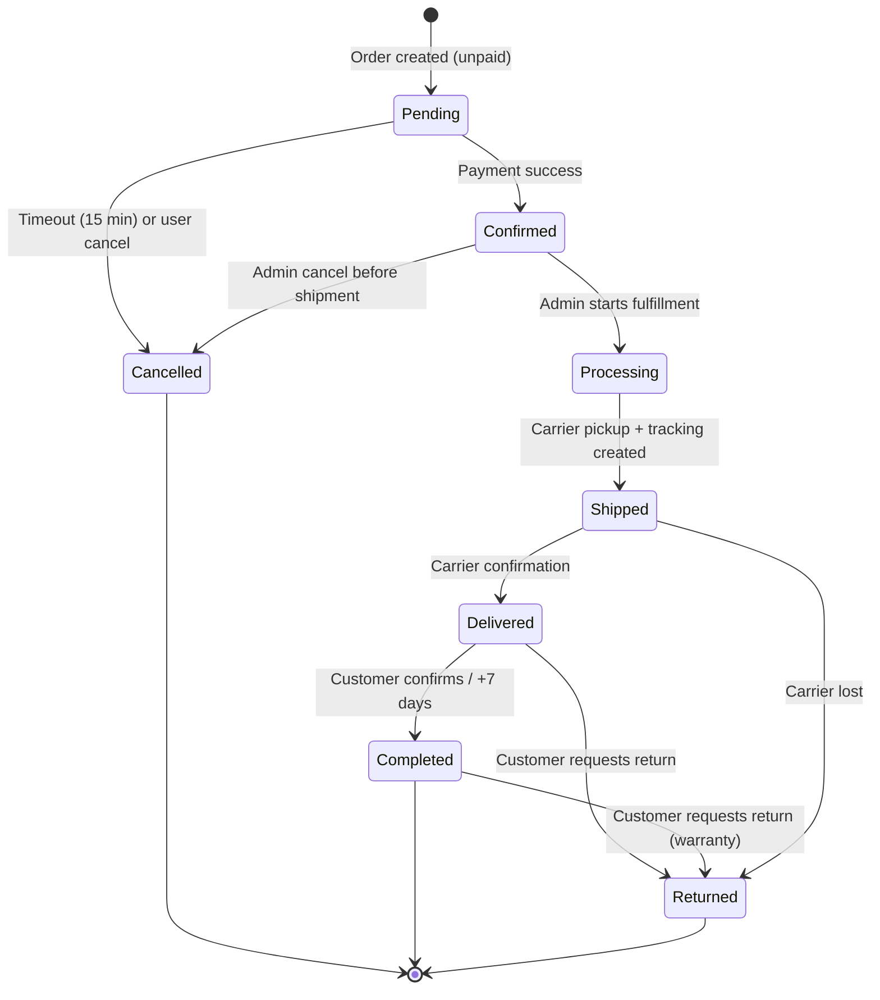

# SmartLight — Software Requirements Specification (SRS)

| Field | Value |
| --- | --- |
| **Document ID** | `BA-SRS-001` |
| **Document Owner** | Principal Business Analyst |
| **Status** | Draft — v0.1 |
| **Created Date** | 2026-07-02 |
| **Last Reviewed** | 2026-07-02 |
| **Next Review** | 2026-08-01 |
| **Standard** | IEEE 830 / ISO 29148 |
| **Classification** | Business Analysis — Authoritative |
| **Audience** | Engineering, Product, QA, Stakeholders, AI Agents |

> **Source of Truth:** This document conforms to `docs/00-governance/PROJECT_BLUEPRINT.md`, `TECH_STACK.md`, and the rest of the governance corpus. Where conflicts arise, governance wins; this document is updated to match.

---

## 1. Introduction

### 1.1 Purpose

This Software Requirements Specification (SRS) describes the complete functional and non-functional requirements for SmartLight — a single-vendor e-commerce platform specializing in lighting products for the Vietnamese market.

The SRS serves as:

1. The **contract** between Product, Engineering, QA, and stakeholders.
2. The **input** to system architecture, design, and test planning.
3. The **baseline** for change control and scope management.
4. The **reference** for AI agents contributing to requirement-related artifacts.

### 1.2 Scope

SmartLight is a web-based single-vendor e-commerce platform with the following in-scope capabilities:

- Product catalog (lighting products with technical specifications).
- Customer accounts, authentication, and profiles.
- Shopping cart and checkout.
- Order management and fulfillment.
- Payments via Vietnamese providers.
- Shipping via Vietnamese carriers.
- Returns and warranty handling.
- Customer reviews and ratings.
- Promotions, vouchers, and flash sales.
- Administrative operations console.
- Vietnamese-language user interface.
- Analytics and reporting.

Out of scope for Version 1:

- Multi-seller marketplace (deferred to V2).
- Mobile native applications (V1.5+).
- Multi-language (V1.5+).
- AI sales assistant (V1.5+).
- AI customer support (V1.5+).
- International shipping.

### 1.3 Definitions, Acronyms, Abbreviations

See `docs/01-business-analysis/GLOSSARY.md`.

### 1.4 References

| ID | Document |
| --- | --- |
| R-01 | `docs/00-governance/PROJECT_BLUEPRINT.md` |
| R-02 | `docs/00-governance/TECH_STACK.md` |
| R-03 | `docs/00-governance/REPOSITORY_STRUCTURE.md` |
| R-04 | `docs/00-governance/DEVELOPMENT_RULES.md` |
| R-05 | `docs/00-governance/CODING_STANDARDS.md` |
| R-06 | `docs/00-governance/GIT_WORKFLOW.md` |
| R-07 | `docs/00-governance/VERSIONING_STRATEGY.md` |
| R-08 | `docs/00-governance/ROADMAP.md` |
| R-09 | `docs/00-governance/DEFINITION_OF_DONE.md` |
| R-10 | `docs/00-governance/AI_DEVELOPMENT_RULES.md` |
| R-11 | `docs/01-business-analysis/SYSTEM_FEATURES.md` |
| R-12 | `docs/01-business-analysis/BUSINESS_RULES.md` |
| R-13 | `docs/01-business-analysis/USER_STORIES.md` |
| R-14 | `docs/01-business-analysis/ACCEPTANCE_CRITERIA.md` |
| R-15 | IEEE Std 830-1998 — Recommended Practice for Software Requirements Specifications |
| R-16 | ISO/IEC/IEEE 29148:2018 — Systems and software engineering — Life cycle processes — Requirements engineering |

### 1.5 Document Overview

| Section | Title | Content |
| --- | --- | --- |
| 2 | Product Overview | Product perspective, functions, user classes, environment |
| 3 | Business Objectives | Strategic and operational goals |
| 4 | Stakeholders | Direct, indirect, external |
| 5 | User Classes | Detailed personas |
| 6 | Functional Requirements | Capabilities by module |
| 7 | Non-functional Requirements | Performance, security, usability, etc. |
| 8 | Constraints | Business, technical, regulatory |
| 9 | Assumptions | Detailed in `ASSUMPTIONS.md`; summarized here |
| 10 | External Interfaces | Payment, shipping, email, media |

---

## 2. Product Overview

### 2.1 Product Perspective

SmartLight is a **standalone, self-contained** e-commerce system. It is not a successor to or replacement of any existing system. It will be deployed as:

- A web storefront accessible to public customers.
- An internal admin web application for staff.
- A backend service exposing internal and public APIs.

The system replaces no existing platform in Version 1.

### 2.2 Product Functions (Summary)

| Group | Function Group |
| --- | --- |
| F-CAT | Catalog browsing and product discovery |
| F-CART | Cart and wishlist |
| F-CHK | Checkout and payment |
| F-ORD | Order management |
| F-SHIP | Shipping and tracking |
| F-ID | Identity, accounts, addresses |
| F-REV | Reviews and ratings |
| F-PRM | Promotions, vouchers, flash sales |
| F-RTN | Returns and warranty |
| F-NOT | Notifications (email) |
| F-SUP | Customer support basics |
| F-ADM | Admin operations |
| F-ANL | Analytics and reporting |
| F-I18 | Localization |
| F-PLAT | Platform (health, search, media, SEO) |

### 2.3 User Classes and Characteristics

| Class | Description | Technical Skill | Volume |
| --- | --- | --- | --- |
| **Guest** | Unauthenticated visitor | Low to medium | Very high |
| **Registered Customer (B2C)** | Individual buyer | Medium | High |
| **Commercial Customer** | Business buyer | Medium | Medium |
| **Architect / Designer** | Project specifier | Medium | Low |
| **Customer Support Agent** | Internal staff handling tickets | Medium | Low |
| **Catalog Manager** | Internal staff managing products | Medium | Low |
| **Order Fulfillment Staff** | Internal staff processing orders | Medium | Medium |
| **Marketing Staff** | Internal staff managing promotions | Medium | Low |
| **Finance / Admin Staff** | Internal staff reconciling payments | Medium | Low |
| **System Administrator** | Technical owner of the platform | High | Very low |
| **Store Owner / Product Owner** | Business stakeholder | High | Very low |

### 2.4 Operating Environment

| Surface | Environment |
| --- | --- |
| Customer Browser | Last 2 versions of Chrome, Edge, Firefox, Safari (mobile + desktop) |
| Admin Browser | Same as customer + any modern Chromium-based |
| Mobile Web | iOS Safari 16+, Android Chrome latest |
| Server | Node.js 20 LTS, Linux containers on Render/Railway |
| Database | PostgreSQL 16 on Neon |
| Cache / Queue | Redis (Upstash) |
| Media | Cloudinary CDN |

### 2.5 Design and Implementation Constraints

| Constraint | Source |
| --- | --- |
| React + TypeScript frontend | Governance `TECH_STACK.md` |
| NestJS + TypeScript backend | Governance `TECH_STACK.md` |
| PostgreSQL + Prisma | Governance `TECH_STACK.md` |
| Modular Monolith architecture | Governance `PROJECT_BLUEPRINT.md` |
| Single currency: VND | Governance `PROJECT_BLUEPRINT.md` |
| Single primary language: Vietnamese | Governance `PROJECT_BLUEPRINT.md` |
| Single-vendor business model | Governance `PROJECT_BLUEPRINT.md` |
| Low-cost cloud infrastructure | Governance `PROJECT_BLUEPRINT.md` |

### 2.6 Assumptions and Dependencies

Detailed assumptions are listed in `ASSUMPTIONS.md`. Key dependencies:

- Vietnamese payment provider(s) will be available and integrated.
- Vietnamese shipping carrier(s) will be available and integrated.
- Vietnamese domain (`.vn`) and email infrastructure available.
- Cloud providers (Vercel, Render/Railway, Neon, Upstash, Cloudinary) remain available and meet SLA.

---

## 3. Business Objectives

### 3.1 Strategic Objectives (from `PROJECT_BLUEPRINT.md`)

| ID | Objective | Metric |
| --- | --- | --- |
| BO-1 | Launch a production-ready storefront | Public availability with stable checkout |
| BO-2 | Establish reliable order fulfillment | ≥ 98% successful dispatch rate |
| BO-3 | Build a scalable data foundation | All core entities modeled |
| BO-4 | Deliver operational dashboards | Admin KPIs visible |
| BO-5 | Establish engineering governance | Governance enforced in CI |
| BO-6 | Lay foundation for AI capabilities | Data and integration surfaces ready |

### 3.2 Operational Objectives

| ID | Objective | Target |
| --- | --- | --- |
| OO-1 | Monthly uptime | ≥ 99.5% |
| OO-2 | Conversion rate | ≥ 1.5% |
| OO-3 | Cart abandonment | ≤ 70% |
| OO-4 | Repeat purchase rate | ≥ 20% |
| OO-5 | NPS | ≥ 40 |
| OO-6 | Support ticket rate | ≤ 5% of orders |
| OO-7 | Order processing time | ≤ 24h from placement to dispatch |
| OO-8 | Customer support first-response | ≤ 4 business hours |

### 3.3 Success Criteria

SmartLight Version 1 is considered successful when:

1. The storefront serves real customers in Vietnam.
2. The store processes ≥ 100 orders/day sustained for 30 days.
3. All BO and OO targets are met for at least one quarter.
4. Customer satisfaction (NPS ≥ 40) is achieved.
5. Operational costs remain within low-cost cloud budget envelope.

---

## 4. Stakeholders

### 4.1 Direct Stakeholders

| Stakeholder | Role | Interest | Influence |
| --- | --- | --- | --- |
| **Store Owner / CEO** | Sponsor | Revenue, brand, growth | High |
| **Product Owner** | Product leadership | Feature scope, prioritization | High |
| **Engineering Team** | Builders | Clear, stable requirements | High |
| **QA Team** | Validators | Testable requirements | Medium |
| **Operations Staff** | Daily users | Efficiency, usability | Medium |
| **Marketing Team** | Demand drivers | Promo tools, analytics | Medium |

### 4.2 Indirect Stakeholders

| Stakeholder | Role | Interest |
| --- | --- | --- |
| **Customers** | Buyers | Quality, reliability, price |
| **Suppliers / Brands** | Source of inventory | Stable demand |
| **Payment Providers** | Partners | Compliance, volume |
| **Shipping Carriers** | Partners | Volume, accuracy |
| **Hosting Providers** | Vendors | Service consumption |

### 4.3 External Stakeholders

| Stakeholder | Role |
| --- | --- |
| **Vietnamese regulators** | Tax, e-commerce, consumer protection |
| **Data protection authority** | PDPD compliance |
| **Banks / Payment processors** | Settlement |

---

## 5. User Classes (Detailed)

### 5.1 Guest

| Attribute | Value |
| --- | --- |
| Authentication | None |
| Permissions | Browse catalog, view product details, view static pages, add to cart, view cart, register |
| Limitations | Cannot checkout, cannot view past orders, cannot review |
| Technical Skill | Low |

### 5.2 Registered Customer (B2C)

| Attribute | Value |
| --- | --- |
| Authentication | Email + password, or social login (future) |
| Permissions | All Guest permissions + checkout, order history, reviews, returns, addresses, profile |
| Limitations | Cannot access admin functions |
| Technical Skill | Low to medium |

### 5.3 Commercial Customer

| Attribute | Value |
| --- | --- |
| Authentication | Same as registered customer; account flagged as commercial |
| Permissions | Same as registered customer + bulk operations, saved lists, project carts |
| Limitations | Same as registered customer |
| Technical Skill | Medium |

### 5.4 Architect / Designer

A specialized commercial customer with:

- Access to specification sheets.
- Ability to save and share project carts.
- Access to bulk pricing (when promotions exist).

### 5.5 Customer Support Agent

| Attribute | Value |
| --- | --- |
| Authentication | SSO + RBAC |
| Permissions | Search customers, view orders, view carts (read-only), initiate returns, respond to tickets |
| Limitations | Cannot modify products, prices, or system configuration |

### 5.6 Catalog Manager

| Attribute | Value |
| --- | --- |
| Authentication | SSO + RBAC |
| Permissions | CRUD products, categories, attributes, brands, media |
| Limitations | Cannot process orders or refunds |

### 5.7 Order Fulfillment Staff

| Attribute | Value |
| --- | --- |
| Authentication | SSO + RBAC |
| Permissions | View orders, update order status, print invoices, trigger shipping |
| Limitations | Cannot modify catalog or prices |

### 5.8 Marketing Staff

| Attribute | Value |
| --- | --- |
| Authentication | SSO + RBAC |
| Permissions | CRUD promotions, vouchers, flash sales, view analytics |
| Limitations | Cannot process orders |

### 5.9 Finance / Admin Staff

| Attribute | Value |
| --- | --- |
| Authentication | SSO + RBAC |
| Permissions | View financial reports, reconcile payments, issue manual refunds (with approval) |
| Limitations | Cannot modify catalog structure |

### 5.10 System Administrator

| Attribute | Value |
| --- | --- |
| Authentication | SSO + RBAC + MFA mandatory |
| Permissions | Manage admin users, roles, configurations, feature flags |
| Limitations | Cannot bypass audit log |

### 5.11 Store Owner / Product Owner

| Attribute | Value |
| --- | --- |
| Authentication | SSO + MFA |
| Permissions | Read all data, approve high-risk operations |
| Limitations | Cannot directly modify data without audit |

---

## 6. Functional Requirements

The functional requirements are organized by domain (bounded context). Each requirement has a stable ID for traceability. Detailed feature descriptions are in `SYSTEM_FEATURES.md`.

### 6.1 Catalog (F-CAT)

| ID | Requirement |
| --- | --- |
| FR-CAT-001 | The system shall display products grouped by category. |
| FR-CAT-002 | The system shall support nested categories up to 3 levels deep. |
| FR-CAT-003 | The system shall allow searching products by name, SKU, brand, and category. |
| FR-CAT-004 | The system shall support filtering products by attributes (price range, wattage, color temperature, IP rating, etc.). |
| FR-CAT-005 | The system shall display product variants (color, size, wattage) on the product detail page. |
| FR-CAT-006 | The system shall show product availability status (in stock, low stock, out of stock). |
| FR-CAT-007 | The system shall allow viewing related products and complementary products. |
| FR-CAT-008 | The system shall display technical specifications (lumen, wattage, CRI, IP rating, voltage). |
| FR-CAT-009 | The system shall display warranty terms per product. |
| FR-CAT-010 | The system shall support product image gallery with zoom. |
| FR-CAT-011 | The system shall display product videos when provided. |
| FR-CAT-012 | The system shall generate SEO-friendly product URLs. |
| FR-CAT-013 | The system shall generate structured data (JSON-LD) for products. |
| FR-CAT-014 | The system shall support product sorting (price, newest, popularity, rating). |
| FR-CAT-015 | The system shall support pagination of product lists. |

### 6.2 Cart and Wishlist (F-CART)

| ID | Requirement |
| --- | --- |
| FR-CRT-001 | The system shall allow guests to add products to a cart. |
| FR-CRT-002 | The system shall persist guest carts via cookie for 30 days. |
| FR-CRT-003 | The system shall merge guest cart into customer account upon login. |
| FR-CRT-004 | The system shall allow updating line item quantity. |
| FR-CRT-005 | The system shall allow removing line items from cart. |
| FR-CRT-006 | The system shall display cart subtotal, estimated tax, and shipping estimate. |
| FR-CRT-007 | The system shall reserve stock for cart items for 15 minutes during checkout. |
| FR-CRT-008 | The system shall allow customers to save cart items for later (wishlist). |
| FR-CRT-009 | The system shall allow moving wishlist items back to cart. |
| FR-CRT-010 | The system shall apply vouchers to cart totals. |
| FR-CRT-011 | The system shall display applied promotion details. |
| FR-CRT-012 | The system shall expire abandoned cart reminders (email) after 24h and 72h. |

### 6.3 Checkout (F-CHK)

| ID | Requirement |
| --- | --- |
| FR-CHK-001 | The system shall provide a multi-step checkout (address → shipping → payment → review). |
| FR-CHK-002 | The system shall allow guest checkout with email. |
| FR-CHK-003 | The system shall allow logged-in customers to use saved addresses. |
| FR-CHK-004 | The system shall validate Vietnamese phone numbers and addresses. |
| FR-CHK-005 | The system shall compute shipping fees by zone and weight. |
| FR-CHK-006 | The system shall support multiple payment methods (provider-dependent). |
| FR-CHK-007 | The system shall redirect to payment provider securely. |
| FR-CHK-008 | The system shall handle payment callbacks via webhook. |
| FR-CHK-009 | The system shall prevent double-submit of checkout form. |
| FR-CHK-010 | The system shall display order summary on the review step. |
| FR-CHK-011 | The system shall send order confirmation email after successful payment. |
| FR-CHK-012 | The system shall retain checkout state for 15 minutes if interrupted. |

### 6.4 Order Management (F-ORD)

| ID | Requirement |
| --- | --- |
| FR-ORD-001 | The system shall create an order upon successful payment. |
| FR-ORD-002 | The system shall assign each order a unique order number. |
| FR-ORD-003 | The system shall maintain order lifecycle: Pending → Confirmed → Processing → Shipped → Delivered → Completed. |
| FR-ORD-004 | The system shall support Cancelled and Returned states. |
| FR-ORD-005 | The system shall record all status changes with timestamp and actor. |
| FR-ORD-006 | The system shall allow customers to view order history. |
| FR-ORD-007 | The system shall allow customers to view detailed order status with tracking. |
| FR-ORD-008 | The system shall allow admin staff to update order status. |
| FR-ORD-009 | The system shall generate invoices in PDF format. |
| FR-ORD-010 | The system shall print picklists for warehouse operations. |
| FR-ORD-011 | The system shall support partial shipments per order. |
| FR-ORD-012 | The system shall detect and flag duplicate orders. |

### 6.5 Shipping (F-SHIP)

| ID | Requirement |
| --- | --- |
| FR-SHP-001 | The system shall calculate shipping fees by zone and weight. |
| FR-SHP-002 | The system shall support multiple shipping carriers. |
| FR-SHP-003 | The system shall generate shipping labels via carrier API. |
| FR-SHP-004 | The system shall send tracking numbers to customers. |
| FR-SHP-005 | The system shall reconcile tracking status via carrier webhook or polling. |
| FR-SHP-006 | The system shall notify customers on shipment status changes. |
| FR-SHP-007 | The system shall support estimated delivery date display. |
| FR-SHP-008 | The system shall allow customers to choose delivery time windows (where supported). |

### 6.6 Identity and Accounts (F-ID)

| ID | Requirement |
| --- | --- |
| FR-ID-001 | The system shall allow users to register with email and password. |
| FR-ID-002 | The system shall enforce password complexity rules. |
| FR-ID-003 | The system shall send email verification upon registration. |
| FR-ID-004 | The system shall allow users to log in with email + password. |
| FR-ID-005 | The system shall issue JWT access tokens and refresh tokens. |
| FR-ID-006 | The system shall allow users to reset forgotten passwords via email. |
| FR-ID-007 | The system shall allow users to update profile information. |
| FR-ID-008 | The system shall allow users to manage multiple addresses. |
| FR-ID-009 | The system shall allow users to change password. |
| FR-ID-010 | The system shall log out users and invalidate refresh tokens. |
| FR-ID-011 | The system shall support admin staff authentication with MFA. |
| FR-ID-012 | The system shall enforce RBAC for admin functions. |
| FR-ID-013 | The system shall lock accounts after 5 failed login attempts for 15 minutes. |

### 6.7 Reviews and Ratings (F-REV)

| ID | Requirement |
| --- | --- |
| FR-RVW-001 | The system shall allow verified purchasers to leave reviews. |
| FR-RVW-002 | The system shall allow 1–5 star ratings. |
| FR-RVW-003 | The system shall allow text reviews up to 1000 characters. |
| FR-RVW-004 | The system shall allow photo uploads in reviews (max 5). |
| FR-RVW-005 | The system shall moderate reviews before publishing (default). |
| FR-RVW-006 | The system shall aggregate average rating per product. |
| FR-RVW-007 | The system shall allow admin to approve, reject, or remove reviews. |
| FR-RVW-008 | The system shall allow customers to mark reviews as helpful. |
| FR-RVW-009 | The system shall respond to reviews (admin or seller — V1 admin). |

### 6.8 Promotions (F-PRM)

| ID | Requirement |
| --- | --- |
| FR-PRM-001 | The system shall support percentage-based discounts. |
| FR-PRM-002 | The system shall support fixed-amount discounts (VND). |
| FR-PRM-003 | The system shall support Buy X Get Y (BOGO) promotions. |
| FR-PRM-004 | The system shall support tiered discounts (spend ≥ X, get Y). |
| FR-PRM-005 | The system shall support voucher codes. |
| FR-PRM-006 | The system shall allow stacking rules per promotion. |
| FR-PRM-007 | The system shall support flash sales (time-bound promotions). |
| FR-PRM-008 | The system shall display flash sale countdowns. |
| FR-PRM-009 | The system shall enforce promotion start/end times. |
| FR-PRM-010 | The system shall enforce usage limits (per user, total). |
| FR-PRM-011 | The system shall display original and discounted prices. |
| FR-PRM-012 | The system shall require admin approval for promotions above a threshold. |

### 6.9 Returns and Warranty (F-RTN)

| ID | Requirement |
| --- | --- |
| FR-RTN-001 | The system shall allow customers to request returns within 7 days of delivery. |
| FR-RTN-002 | The system shall support return reasons (defective, wrong item, no longer needed). |
| FR-RTN-003 | The system shall generate Return Merchandise Authorization (RMA) numbers. |
| FR-RTN-004 | The system shall allow admin to approve or reject return requests. |
| FR-RTN-005 | The system shall track return shipment status. |
| FR-RTN-006 | The system shall process refunds upon receipt confirmation. |
| FR-RTN-007 | The system shall honor product warranty claims per product terms. |
| FR-RTN-008 | The system shall record warranty claims and outcomes. |
| FR-RTN-009 | The system shall notify customers of return/warranty status changes. |

### 6.10 Notifications (F-NOT)

| ID | Requirement |
| --- | --- |
| FR-NOT-001 | The system shall send transactional emails for key events. |
| FR-NOT-002 | The system shall support email templates in Vietnamese. |
| FR-NOT-003 | The system shall allow admin to manage email templates. |
| FR-NOT-004 | The system shall queue emails for retry on failure. |
| FR-NOT-005 | The system shall allow users to manage notification preferences. |
| FR-NOT-006 | The system shall not send marketing emails without consent. |

### 6.11 Customer Support (F-SUP)

| ID | Requirement |
| --- | --- |
| FR-SUP-001 | The system shall allow customers to submit support tickets. |
| FR-SUP-002 | The system shall allow customers to attach files to tickets. |
| FR-SUP-003 | The system shall allow support agents to view and respond to tickets. |
| FR-SUP-004 | The system shall support internal notes on tickets. |
| FR-SUP-005 | The system shall link tickets to orders. |
| FR-SUP-006 | The system shall track ticket status (Open, Pending, Resolved, Closed). |
| FR-SUP-007 | The system shall measure first-response time per ticket. |

### 6.12 Admin Operations (F-ADM)

| ID | Requirement |
| --- | --- |
| FR-ADM-001 | The system shall provide a dashboard with KPIs (orders, revenue, AOV, conversion). |
| FR-ADM-002 | The system shall allow admin to manage products, categories, and attributes. |
| FR-ADM-003 | The system shall allow admin to manage orders and update statuses. |
| FR-ADM-004 | The system shall allow admin to manage customers. |
| FR-ADM-005 | The system shall allow admin to manage promotions. |
| FR-ADM-006 | The system shall allow admin to manage returns and refunds. |
| FR-ADM-007 | The system shall allow admin to manage reviews and ratings. |
| FR-ADM-008 | The system shall allow admin to manage support tickets. |
| FR-ADM-009 | The system shall allow admin to manage admin users and roles. |
| FR-ADM-010 | The system shall record audit logs for sensitive operations. |
| FR-ADM-011 | The system shall allow admin to manage site content (banners, static pages). |
| FR-ADM-012 | The system shall allow admin to view operational reports. |

### 6.13 Analytics and Reporting (F-ANL)

| ID | Requirement |
| --- | --- |
| FR-ANL-001 | The system shall track sessions, page views, and conversion events. |
| FR-ANL-002 | The system shall provide daily, weekly, monthly sales reports. |
| FR-ANL-003 | The system shall provide product performance reports. |
| FR-ANL-004 | The system shall provide customer cohort reports. |
| FR-ANL-005 | The system shall provide inventory reports (low stock, stockouts). |
| FR-ANL-006 | The system shall export reports to CSV. |
| FR-ANL-007 | The system shall support funnel analysis (view → cart → checkout → purchase). |

### 6.14 Localization (F-I18)

| ID | Requirement |
| --- | --- |
| FR-I18-001 | The system shall display all user-facing text in Vietnamese by default. |
| FR-I18-002 | The system shall format dates per `vi-VN` locale. |
| FR-I18-003 | The system shall format numbers per `vi-VN` locale. |
| FR-I18-004 | The system shall display all prices in VND. |
| FR-I18-005 | The system shall be architected to support additional languages without refactor. |

### 6.15 Platform (F-PLAT)

| ID | Requirement |
| --- | --- |
| FR-PLT-001 | The system shall expose `/health` and `/version` endpoints. |
| FR-PLT-002 | The system shall support sitemap.xml and robots.txt. |
| FR-PLT-003 | The system shall implement structured data (JSON-LD) for products and breadcrumbs. |
| FR-PLT-004 | The system shall support Open Graph and Twitter Card metadata. |
| FR-PLT-005 | The system shall support feature flags for gradual rollouts. |
| FR-PLT-006 | The system shall log structured events for analytics. |
| FR-PLT-007 | The system shall integrate with Cloudinary for media optimization. |

### 6.16 Inventory (F-INV) — NEW in v1.0

| ID | Requirement |
| --- | --- |
| FR-INV-001 | The system shall maintain stock-on-hand per product variant, single warehouse. |
| FR-INV-002 | The system shall reserve stock for 15 minutes on add-to-cart and convert reservation to decrement on order creation. |
| FR-INV-003 | The system shall release reservation on cart abandonment, checkout timeout, or cancellation. |
| FR-INV-004 | The system shall detect concurrent reservation attempts and serialize stock mutations via database locks. |
| FR-INV-005 | The system shall notify admin via dashboard banner and email when variant stock falls below a configurable threshold. |
| FR-INV-006 | The system shall support manual stock adjustments with mandatory reason code and audit trail. |
| FR-INV-007 | The system shall support restock (return-to-stock) after successful return inspection; non-sellable items shall be flagged for disposal. |
| FR-INV-008 | The system shall display real-time stock status on PDP (In Stock / Low Stock / Out of Stock). |
| FR-INV-009 | The system shall reconcile stock on every order state transition (paid, fulfilled, cancelled, returned). |

### 6.17 Payments (F-PAY) — NEW in v1.0

| ID | Requirement |
| --- | --- |
| FR-PAY-001 | The system shall create a payment intent via the payment provider, persisting intent ID with the order. |
| FR-PAY-002 | The system shall support Vietnamese payment providers (VNPay, MoMo, or ZaloPay) configured per environment. |
| FR-PAY-003 | The system shall receive webhook callbacks from payment provider with signature verification. |
| FR-PAY-004 | The system shall reconcile payment status on webhook receipt and transition order accordingly. |
| FR-PAY-005 | The system shall support full and partial refunds through the payment provider, with refund ID stored on the order. |
| FR-PAY-006 | The system shall periodically poll payment provider for any orders whose webhook was missed (reconciliation job). |
| FR-PAY-007 | The system shall prevent double-charge via idempotency keys. |
| FR-PAY-008 | The system shall retain payment transaction logs for at least 2 years for audit and tax reporting. |

### 6.18 Media (F-MED) — NEW in v1.0

| ID | Requirement |
| --- | --- |
| FR-MED-001 | The system shall upload product images via signed direct upload to Cloudinary. |
| FR-MED-002 | The system shall auto-generate responsive variants (thumbnail, card, hero, zoom) via Cloudinary transformations. |
| FR-MED-003 | The system shall retrieve images via Cloudinary CDN URLs with transformation parameters. |
| FR-MED-004 | The system shall enforce image type (JPEG, PNG, WebP) and size (≤ 5 MB) constraints. |
| FR-MED-005 | The system shall associate images with product variants and support image ordering. |

### 6.19 Tax / VAT (F-TAX) — NEW in v1.0

| ID | Requirement |
| --- | --- |
| FR-TAX-001 | The system shall calculate VAT (default 10%) on every taxable line item and order. |
| FR-TAX-002 | The system shall display VAT as a separate line on cart, checkout, order confirmation, and invoice. |
| FR-TAX-003 | The system shall allow admin to mark product categories as tax-exempt with audit trail. |
| FR-TAX-004 | The system shall store VAT rate effective at the time of sale for historical accuracy. |
| FR-TAX-005 | The system shall generate a VAT report (taxable sales, VAT collected) exportable as CSV. |

### 6.20 Order State Machine (NEW in v1.0)

> **Added per REVIEW_REPORT.md RC-07.** The order state machine formalizes the complete lifecycle with allowed/forbidden transitions.

**Transition Table:**

| From State | To State | Trigger | Actor | Pre-condition |
| --- | --- | --- | --- | --- |
| Pending | Confirmed | Payment webhook success | System (payment provider) | Payment intent status = paid |
| Pending | Cancelled | Timeout 15 min | System (scheduler) | No payment received |
| Pending | Cancelled | User cancel | Customer or Guest | Order not yet paid |
| Confirmed | Processing | Start fulfillment | Admin staff | Inventory available |
| Processing | Shipped | Carrier pickup | Admin staff | Tracking number assigned |
| Shipped | Delivered | Carrier delivery | System (carrier webhook) | Tracking status = delivered |
| Delivered | Completed | Customer confirm or +7 days | System / Customer | Delivered date recorded |
| Delivered | Returned | Customer return request | Customer | Within 7-day window |
| Completed | Returned | Customer return request | Customer | Within warranty window |
| Confirmed | Cancelled | Admin cancel | Admin staff | Not yet shipped |
| Shipped | Returned | Carrier lost | System / Admin | Carrier confirmed lost |

**Forbidden Transitions:**

- `Pending → Shipped` (must go through Confirmed → Processing)
- `Cancelled → Confirmed` (cancellation is terminal)
- `Completed → Pending` (immutable after completion)
- `Returned → Delivered` (returned is terminal)
- `Any → Pending` (no state may revert to Pending)
- `Pending → Returned` (cannot return unpaid order)

---

## 7. Non-Functional Requirements

### 7.1 Performance

| ID | Requirement | Target |
| --- | --- | --- |
| NFR-PERF-001 | Storefront TTFB (cached) | < 200 ms (p95) |
| NFR-PERF-002 | Storefront TTFB (uncached) | < 600 ms (p95) |
| NFR-PERF-003 | API read response | < 250 ms (p95) |
| NFR-PERF-004 | API write response | < 500 ms (p95) |
| NFR-PERF-005 | Largest Contentful Paint | < 2.5 s on 4G |
| NFR-PERF-006 | Time to Interactive | < 4 s on 4G |
| NFR-PERF-007 | Catalog search response | < 500 ms (p95) |
| NFR-PERF-008 | Admin dashboard load | < 1.5 s (p95) |

### 7.2 Availability and Reliability

| ID | Requirement | Target |
| --- | --- | --- |
| NFR-AVAIL-001 | Monthly uptime | ≥ 99.5% |
| NFR-AVAIL-002 | Recovery Time Objective (RTO) | ≤ 4 hours |
| NFR-AVAIL-003 | Recovery Point Objective (RPO) | ≤ 1 hour |
| NFR-AVAIL-004 | Backups | Daily automated, 30-day retention |
| NFR-AVAIL-005 | Zero-downtime deployments | Required for frontend; best-effort for backend |

### 7.3 Security

| ID | Requirement |
| --- | --- |
| NFR-SEC-001 | TLS 1.2+ enforced for all traffic. |
| NFR-SEC-002 | HSTS enabled. |
| NFR-SEC-003 | OWASP Top 10 baseline compliance. |
| NFR-SEC-004 | All secrets in environment variables; never in source. |
| NFR-SEC-005 | Passwords hashed with Argon2id. |
| NFR-SEC-006 | RBAC enforced server-side for all admin functions. |
| NFR-SEC-007 | Audit log for all sensitive admin operations. |
| NFR-SEC-008 | PCI-DSS scope minimized via tokenized payments. |
| NFR-SEC-009 | Rate limiting on auth, checkout, and public endpoints. |
| NFR-SEC-010 | CSRF protection on state-changing endpoints. |
| NFR-SEC-011 | Account lockout after 5 failed login attempts. |
| NFR-SEC-012 | MFA required for all admin accounts. |
| NFR-SEC-013 | Dependency scanning in CI; critical CVEs block deploy. |
| NFR-SEC-014 | Code scanning (CodeQL) on PR and main. |
| NFR-SEC-015 | Security headers via Helmet (CSP, X-Frame-Options, etc.). |

### 7.4 Scalability

| ID | Requirement |
| --- | --- |
| NFR-SCALE-001 | Stateless application tier supports horizontal scaling. |
| NFR-SCALE-002 | Database connection pooling enabled. |
| NFR-SCALE-003 | Cache layer (Redis) supports up to 10x baseline load. |
| NFR-SCALE-004 | Background jobs processed asynchronously via queue. |
| NFR-SCALE-005 | System supports 500 concurrent active users (Phase 1). |
| NFR-SCALE-006 | System supports 100 orders/minute sustained (Phase 1). |

### 7.5 Maintainability

| ID | Requirement |
| --- | --- |
| NFR-MAINT-001 | Strict TypeScript on frontend and backend. |
| NFR-MAINT-002 | Module dependency rules enforced by tooling. |
| NFR-MAINT-003 | Test coverage: ≥ 80% backend modules, ≥ 70% frontend features. |
| NFR-MAINT-004 | All changes via PR with required reviews. |
| NFR-MAINT-005 | Automated CI pipeline runs on every PR. |
| NFR-MAINT-006 | Architecture Decision Records (ADRs) for major decisions. |
| NFR-MAINT-007 | Each module has a README describing responsibility and public API. |

### 7.6 Observability

| ID | Requirement |
| --- | --- |
| NFR-OBS-001 | Structured JSON logging across all services. |
| NFR-OBS-002 | Request ID propagated across all logs. |
| NFR-OBS-003 | Application metrics: request rate, error rate, latency. |
| NFR-OBS-004 | Centralized error tracking with stack traces. |
| NFR-OBS-005 | Uptime monitoring on key endpoints. |
| NFR-OBS-006 | Alerts on Sev-1 conditions. |

### 7.7 Usability

| ID | Requirement |
| --- | --- |
| NFR-USE-001 | WCAG 2.1 Level AA compliance target for storefront. |
| NFR-USE-002 | All interactive elements keyboard accessible. |
| NFR-USE-003 | Color contrast ≥ 4.5:1 for text. |
| NFR-USE-004 | Screen-reader friendly semantic HTML. |
| NFR-USE-005 | Form validation messages in clear Vietnamese. |
| NFR-USE-006 | Mobile-responsive across breakpoints. |

### 7.8 Compatibility

| ID | Requirement |
| --- | --- |
| NFR-COMPAT-001 | Chrome, Edge, Firefox, Safari (last 2 versions). |
| NFR-COMPAT-002 | iOS Safari 16+, Android Chrome latest. |
| NFR-COMPAT-003 | Backend runs on Node.js 20 LTS. |

### 7.9 Compliance and Legal

| ID | Requirement |
| --- | --- |
| NFR-COMP-001 | Compliance with Vietnamese PDPD (Personal Data Protection Decree). |
| NFR-COMP-002 | Compliance with Vietnamese e-commerce regulations. |
| NFR-COMP-003 | Compliance with Vietnamese tax and invoicing requirements. |
| NFR-COMP-004 | Cookie consent banner for non-essential cookies. |
| NFR-COMP-005 | Honest advertising and clear return/warranty policies. |

### 7.10 Internationalization

| ID | Requirement |
| --- | --- |
| NFR-I18-001 | All user-facing strings externalized to translation files. |
| NFR-I18-002 | Architecture supports additional locales without refactor. |
| NFR-I18-003 | Dates, numbers, currency formatted per `vi-VN`. |
| NFR-I18-004 | Time zone: `Asia/Ho_Chi_Minh` for display; UTC for storage. |

---

## 8. Constraints

### 8.1 Business Constraints

| ID | Constraint |
| --- | --- |
| BC-01 | Single-vendor business model in Version 1. |
| BC-02 | Vietnamese market only. |
| BC-03 | VND is the only accepted currency. |
| BC-04 | Vietnamese is the default and only required UI language in V1. |
| BC-05 | Low-cost infrastructure envelope must be respected. |

### 8.2 Technical Constraints

| ID | Constraint |
| --- | --- |
| TC-01 | Frontend must use React + TypeScript. |
| TC-02 | Backend must use NestJS + TypeScript. |
| TC-03 | Database must be PostgreSQL with Prisma ORM. |
| TC-04 | Architecture is a Modular Monolith in V1. |
| TC-05 | All payments must be processed by licensed Vietnamese providers. |
| TC-06 | All shipping handled by Vietnamese carriers. |
| TC-07 | All money handled in VND; no floats for currency. |

### 8.3 Regulatory Constraints

| ID | Constraint |
| --- | --- |
| RC-01 | Compliance with Vietnamese consumer protection law. |
| RC-02 | Compliance with Vietnamese PDPD. |
| RC-03 | Compliance with tax regulations (VAT handling). |
| RC-04 | E-invoice compliance where required. |

### 8.4 Operational Constraints

| ID | Constraint |
| --- | --- |
| OC-01 | All changes must pass through PR review and CI. |
| OC-02 | Direct push to `main` is forbidden. |
| OC-03 | Definition of Done applies to all work. |
| OC-04 | Production deploys must be approved by Tech Lead and Product Owner. |

---

## 9. Assumptions (Summary)

See `ASSUMPTIONS.md` for full list. Key assumptions:

1. Vietnamese payment providers (e.g., VNPay, MoMo, ZaloPay) provide stable APIs and webhooks.
2. Vietnamese shipping carriers (e.g., GHN, GHTK, Viettel Post) provide rate calculation and tracking APIs.
3. Cloud infrastructure providers (Vercel, Render/Railway, Neon, Upstash, Cloudinary) meet stated SLAs.
4. Vietnamese domain and email infrastructure are available.
5. Customer addresses conform to Vietnamese administrative divisions (province → district → ward).
6. Vietnamese phone numbers follow the standard format (+84, 10 digits).
7. The platform will serve 100 orders/day at GA.
8. Admin staff are trained before go-live.

---

## 10. External Interfaces

### 10.1 Payment Gateway Interfaces

| ID | Interface | Direction | Notes |
| --- | --- | --- | --- |
| EI-PAY-01 | Create payment intent | Outbound | HTTPS, JSON |
| EI-PAY-02 | Payment callback webhook | Inbound | HTTPS, signed |
| EI-PAY-03 | Refund request | Outbound | HTTPS, JSON |
| EI-PAY-04 | Transaction query | Outbound | HTTPS, JSON |

### 10.2 Shipping Carrier Interfaces

| ID | Interface | Direction | Notes |
| --- | --- | --- | --- |
| EI-SHP-01 | Rate calculation | Outbound | HTTPS, JSON |
| EI-SHP-02 | Create shipment | Outbound | HTTPS, JSON |
| EI-SHP-03 | Cancel shipment | Outbound | HTTPS, JSON |
| EI-SHP-04 | Tracking webhook | Inbound | HTTPS, signed |
| EI-SHP-05 | Tracking query | Outbound | HTTPS, JSON |

### 10.3 Email Provider Interface

| ID | Interface | Direction | Notes |
| --- | --- | --- | --- |
| EI-EML-01 | Send transactional email | Outbound | HTTPS, JSON |
| EI-EML-02 | Bounce webhook | Inbound | HTTPS, signed |
| EI-EML-03 | Open/click tracking | Inbound | HTTPS (optional) |

### 10.4 Media Provider (Cloudinary) Interface

| ID | Interface | Direction | Notes |
| --- | --- | --- | --- |
| EI-MED-01 | Signed upload | Outbound | HTTPS |
| EI-MED-02 | Image transformation | Outbound | URL parameters |
| EI-MED-03 | Image deletion | Outbound | HTTPS, JSON |

### 10.5 User Interfaces

| Surface | Description |
| --- | --- |
| **Storefront (web)** | Customer-facing shopping interface |
| **Admin (web)** | Internal staff operations console |
| **Mobile (web)** | Mobile-optimized storefront |

### 10.6 Software Interfaces

| Interface | Description |
| --- | --- |
| **OpenAPI 3.1** | Internal API documentation |
| **@smartlight/contracts** | Shared TypeScript types and Zod schemas |

### 10.7 Communication Interfaces

| Interface | Description |
| --- | --- |
| **HTTPS / TLS 1.2+** | All client-server and server-server traffic |
| **JSON over HTTPS** | API request/response format |

---

## 11. Acceptance Criteria Format

Detailed acceptance criteria for each feature are in `ACCEPTANCE_CRITERIA.md` using Gherkin syntax.

---

## 12. Guest Checkout Flow (Clarified per RC-05)

> **Added per REVIEW_REPORT.md.** Guest checkout was previously ambiguous regarding account creation, email verification, and post-purchase behavior.

### 12.1 Guest Checkout Step-by-Step

| Step | Action | System Behavior | Required Data |
| --- | --- | --- | --- |
| 1 | Add to cart | No login required | None |
| 2 | Begin checkout | Prompt for email + shipping address | Email, full name, phone, address |
| 3 | Optional account creation | Checkbox: "Tạo tài khoản với mật khẩu" | Password (optional) |
| 4 | Place order (pay) | Order created with `customerId = NULL`, `guestEmail` populated | — |
| 5 | Email verification | Verification email sent to `guestEmail` (link valid 24h) | — |
| 6 | Order tracking | Guest accesses via magic link in email | — |
| 7 | Future login | Guest may register later with same email; order history attaches | — |

### 12.2 Guest Account Linking Rules

| ID | Rule |
| --- | --- |
| GCH-01 | If guest checks "Create account" during checkout, a customer account is created post-payment with `emailVerified = true` (verification skipped). |
| GCH-02 | If guest does not check "Create account", no account is created. Order stored with `guestEmail` only. |
| GCH-03 | A guest order is linkable to a future customer account if the same email registers later; linking requires email verification. |
| GCH-04 | Guest order tracking uses a one-time magic link (24h expiry, one-use) sent to `guestEmail`. |
| GCH-05 | Guest checkout never blocks on account creation; minimum required fields are email, name, phone, address. |

---

## 13. Document Control

| Version | Date | Author | Change Summary |
| --- | --- | --- | --- |
| 0.1 | 2026-07-02 | Principal Business Analyst | Initial draft |
| 1.0 | 2026-07-03 | Architecture Review Board | Added Inventory (FR-INV), Payments (FR-PAY), Media (FR-MED), Tax (FR-TAX) sections; Order State Machine with Mermaid diagram; Guest Checkout clarification; addressed REVIEW_REPORT.md RC-05..07 |

---

**End of Document — SRS.md**