# ACTIVITY_DIAGRAMS.md — SmartLight

**Project:** SmartLight — Single Vendor E-Commerce Platform
**Document Version:** 1.0
**Status:** Draft
**Date:** 2026-07-03
**Author:** Principal System Analyst

This document contains **activity diagrams** for the major SmartLight workflows. All diagrams use **Mermaid** syntax. Each diagram maps to one or more Use Cases and is referenced in `SYSTEM_WORKFLOWS.md` and `USE_CASE_SPECIFICATIONS.md`.

---

## 1. AD-01 — Login Activity

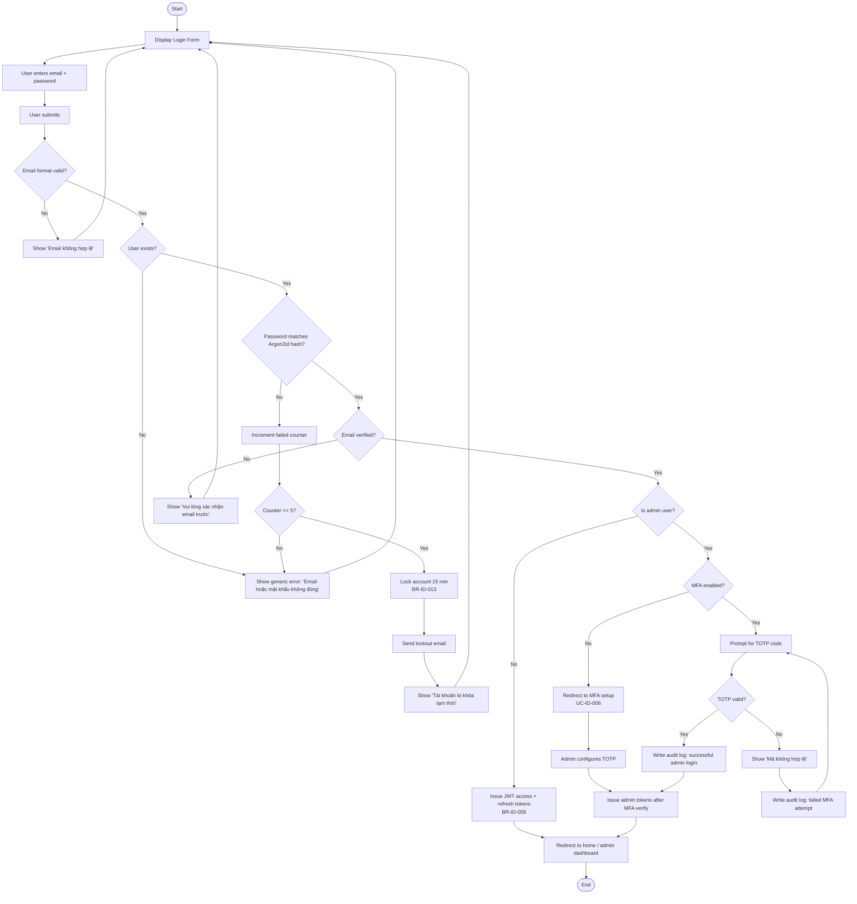

**References:** UC-ID-002, BR-ID-005, BR-ID-013, BR-MFA-001, NFR-SEC-012

---

## 2. AD-02 — Registration Activity

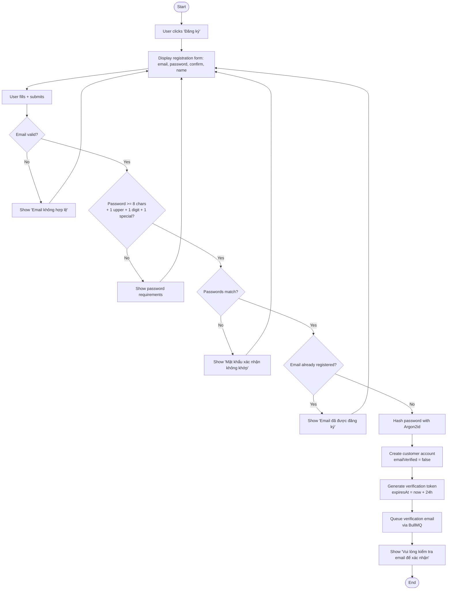

**References:** UC-ID-001, BR-ID-001, BR-ID-002, BR-ID-003, NFR-SEC-005

---

## 3. AD-03 — Product Browsing Activity

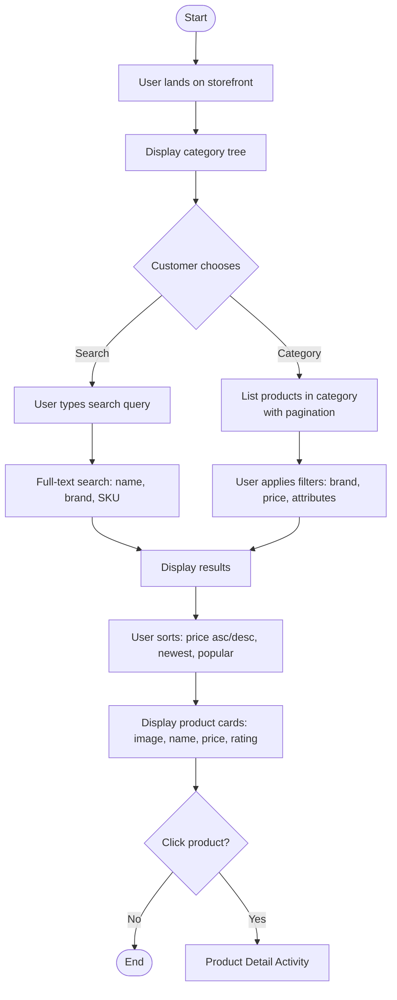

**References:** UC-CAT-001, UC-CAT-002, UC-CAT-003, BR-CAT-001, BR-CAT-004, BR-CAT-005

---

## 4. AD-04 — Product Detail Activity

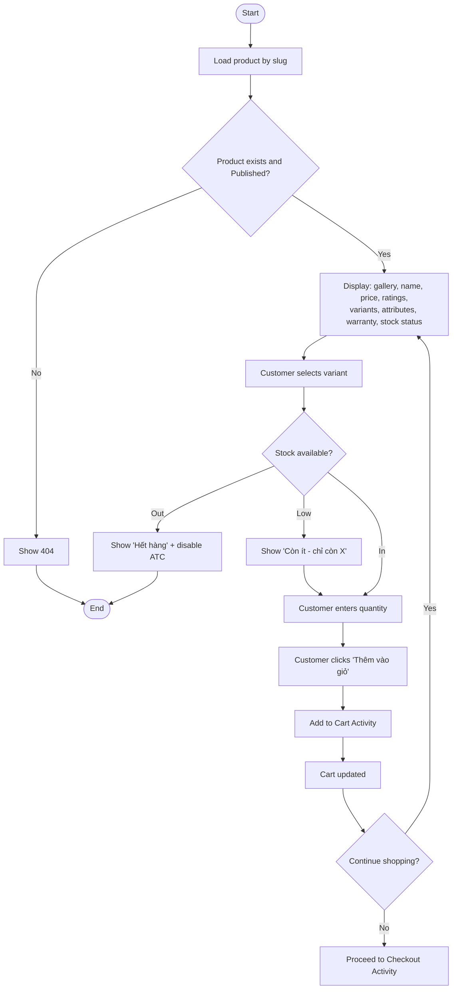

**References:** UC-CAT-004, UC-CAT-005, UC-CRT-001, BR-INV-002, BR-INV-004, BR-CAT-009, BR-CAT-010

---

## 5. AD-05 — Cart Activity

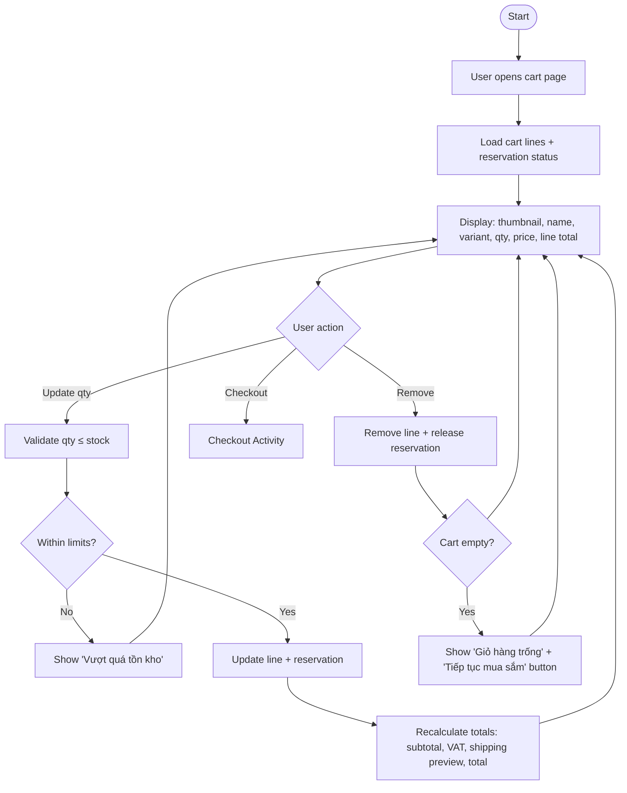

**References:** UC-CRT-002, UC-CRT-003, UC-CRT-004, BR-INV-002, BR-INV-003, BR-X-001, BR-TAX-002

---

## 6. AD-06 — Checkout Activity

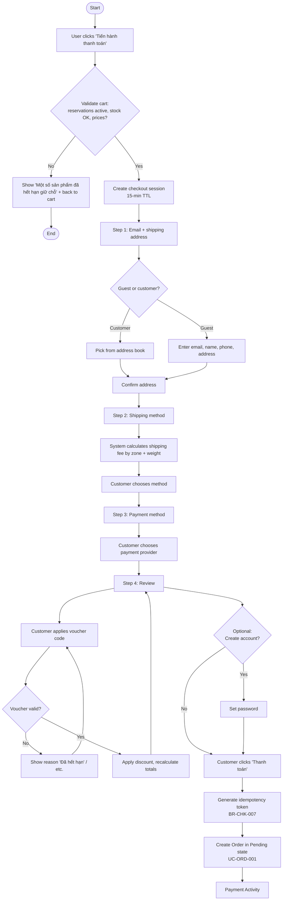

**References:** UC-CHK-001..008, BR-CHK-001..010, BR-INV-002, BR-TAX-001..005, BR-GCH-001..004

---

## 7. AD-07 — Payment Activity

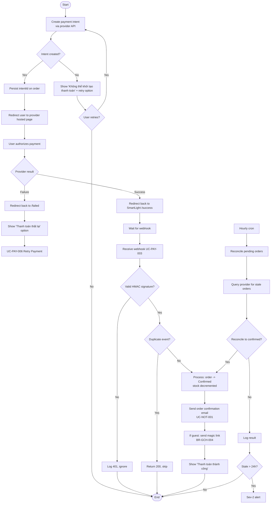

**References:** UC-PAY-001..006, BR-PAY-006..011, BR-PAY-002, BR-PAY-008, BR-PAY-007, BR-INV-001, BR-OSM-001

---

## 8. AD-08 — Order Processing Activity

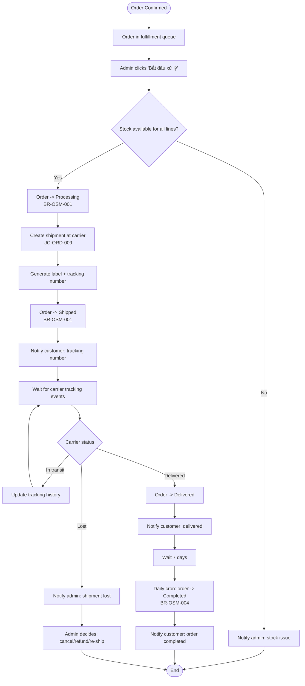

**References:** UC-ORD-007, UC-ORD-009, UC-SHP-002, UC-SHP-003, BR-OSM-001, BR-OSM-004

---

## 9. AD-09 — Return Request Activity

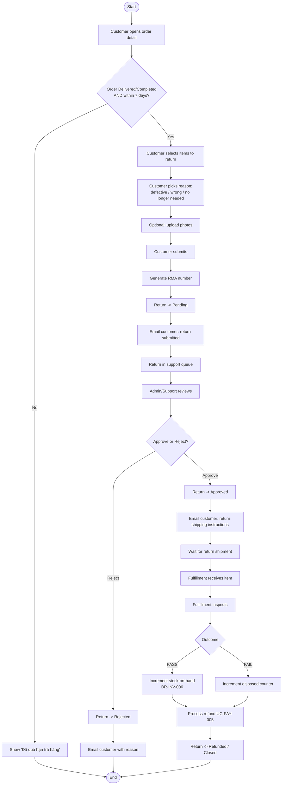

**References:** UC-RTN-001..005, BR-RTN-001..007, BR-INV-006, BR-PAY-009

---

## 10. AD-10 — Review Submission Activity

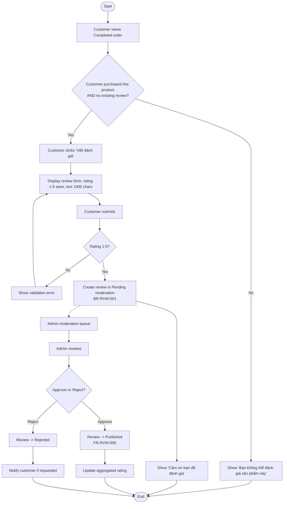

**References:** UC-RVW-001, UC-RVW-002, BR-RVW-001..005

---

## 11. AD-11 — Admin Product Management Activity

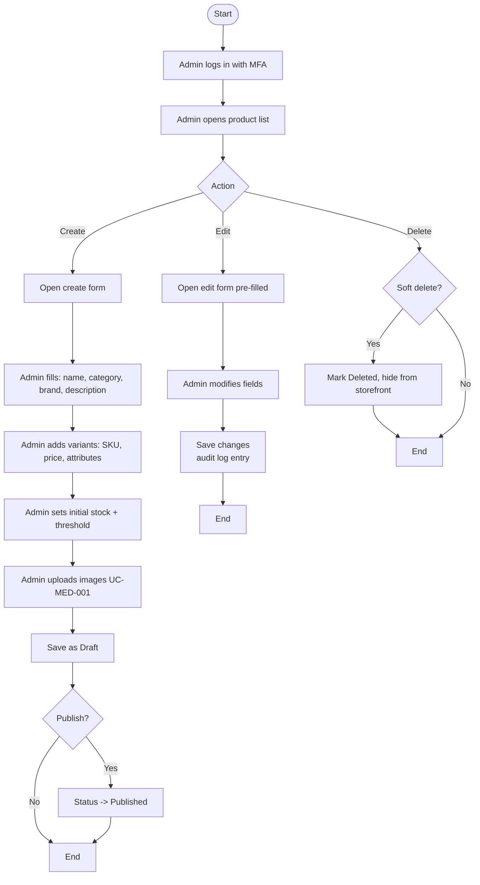

**References:** UC-CAT-009, UC-CAT-010, UC-MED-001, BR-CAT-001..005, BR-ADM-002

---

## 12. AD-12 — Promotion Management Activity

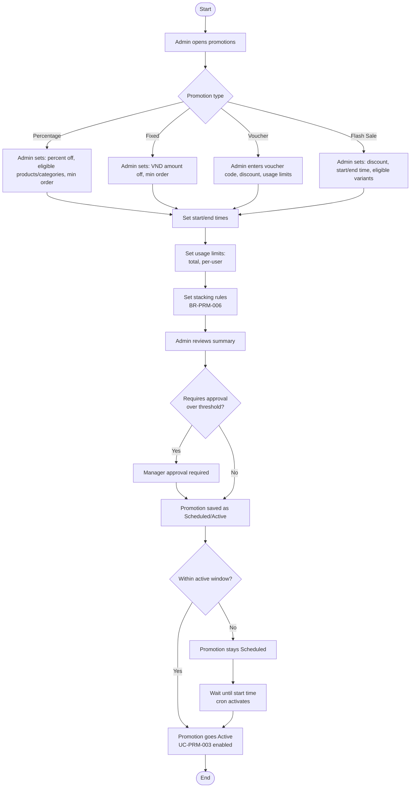

**References:** UC-PRM-001..004, BR-PRM-001..012

---

## 13. Activity Diagram Coverage Matrix

| Activity | Use Case | Business Rules | Features |
| --- | --- | --- | --- |
| AD-01 Login | UC-ID-002 | BR-ID-005, BR-ID-013, BR-MFA-001 | SF-ID-004, SF-ID-005, SF-ID-011 |
| AD-02 Registration | UC-ID-001 | BR-ID-001..003 | SF-ID-001..003 |
| AD-03 Product Browsing | UC-CAT-001..003 | BR-CAT-001..005 | SF-CAT-001..005 |
| AD-04 Product Detail | UC-CAT-004..005 | BR-INV-002, BR-CAT-009..010 | SF-CAT-005..007 |
| AD-05 Cart | UC-CRT-002..004 | BR-INV-002, BR-X-001 | SF-CRT-001..007 |
| AD-06 Checkout | UC-CHK-001..008 | BR-CHK-001..010, BR-GCH-001..004, BR-TAX-001..005 | SF-CHK-001..011 |
| AD-07 Payment | UC-PAY-001..006 | BR-PAY-002, BR-PAY-006..011 | SF-PAY-001..005 |
| AD-08 Order Processing | UC-ORD-007, UC-SHP-002..004 | BR-OSM-001, BR-OSM-004 | SF-ORD-003..004, SF-SHP-002..006 |
| AD-09 Return | UC-RTN-001..005 | BR-RTN-001..007, BR-INV-006 | SF-RTN-001..006 |
| AD-10 Review | UC-RVW-001..002 | BR-RVW-001..005 | SF-RVW-001..005 |
| AD-11 Admin Product | UC-CAT-009..010, UC-MED-001 | BR-CAT-001..005, BR-MED-001..002 | SF-CAT-009..015 |
| AD-12 Promotion | UC-PRM-001..004 | BR-PRM-001..012 | SF-PRM-001..005 |

---

## 14. Document Control

| Version | Date | Author | Change Summary |
| --- | --- | --- | --- |
| 1.0 | 2026-07-03 | Principal System Analyst | Initial 12 activity diagrams in Mermaid syntax; coverage matrix; references to BR and SF |

---

**End of Document — ACTIVITY_DIAGRAMS.md**