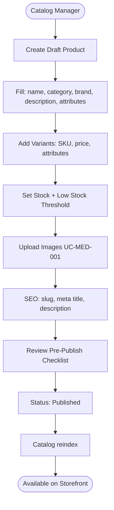
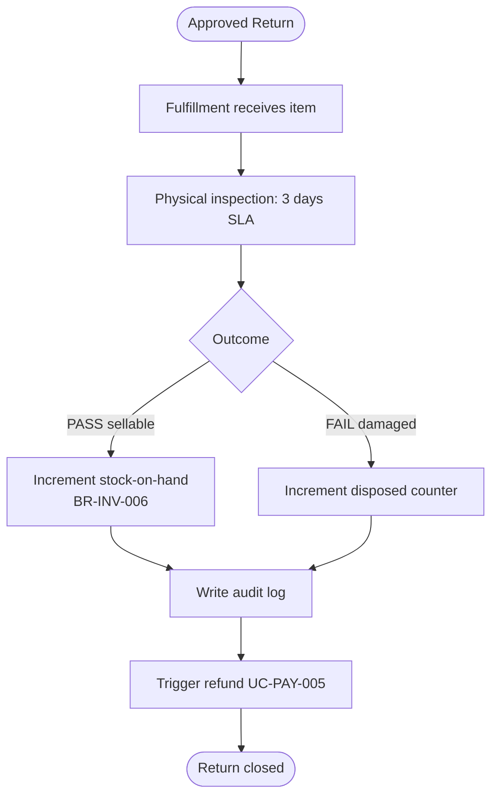
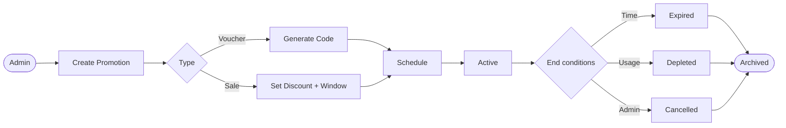
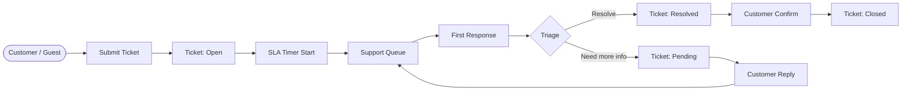
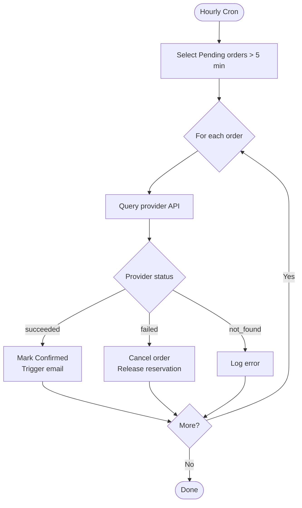
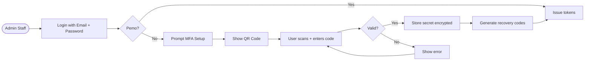
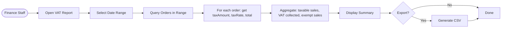
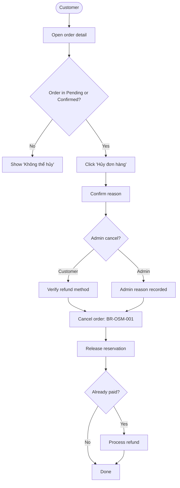
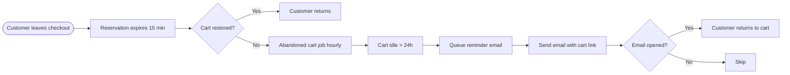

# BUSINESS_PROCESS.md — SmartLight

**Project:** SmartLight — Single Vendor E-Commerce Platform
**Document Version:** 1.0
**Status:** Draft
**Date:** 2026-07-03
**Author:** Principal System Analyst

This document describes all SmartLight **business processes** in BPM-style notation. Each process has inputs, outputs, actors, business rules, and exception handling.

---

## 1. BP-01 — Customer Purchase (End-to-End)

### 1.1 Process Overview

The complete purchase process from product discovery to delivery.

### 1.2 Inputs
- Customer intent (search, category, recommendation)
- Product data (catalog, prices, stock)
- Shipping address
- Payment credentials
- Optional voucher code

### 1.3 Outputs
- Order record with unique order number
- Payment transaction with provider reference
- Shipment with tracking number
- Email notifications (confirmation, shipment, delivery, completion)
- Invoice PDF

### 1.4 Actors
- Customer (primary)
- Payment Gateway (secondary)
- Shipping Carrier (secondary)
- Email Service (secondary)
- Fulfillment Staff (operational)

### 1.5 Business Rules
- BR-INV-001, BR-INV-002 (stock)
- BR-CHK-001..011 (checkout)
- BR-PAY-002, BR-PAY-006..011 (payment)
- BR-TAX-001..005 (VAT)
- BR-OSM-001..004 (order state)
- BR-SHP-005 (tracking)
- BR-NOT-001..005 (notifications)

### 1.6 Exceptions
| Exception | Trigger | Handling |
| --- | --- | --- |
| Out of stock | Stock < requested | Show "Hết hàng"; suggest similar |
| Payment declined | Provider returns failure | Allow retry; release reservation |
| Carrier lost | Tracking = lost | Notify admin; refund or reship |
| Customer dispute | Return request | Open RMA flow |

---

## 2. BP-02 — Product Publishing

### 2.1 Process Overview

### 2.2 Inputs
- Product specifications (Vietnamese + English names)
- Variants (SKU, price, attributes, stock)
- Images (JPEG/PNG/WebP, ≤ 5MB)
- SEO metadata

### 2.3 Outputs
- Published product visible to customers
- Search index entry
- Sitemap entry
- Open Graph metadata

### 2.4 Actors
- Catalog Manager (primary)
- Media CDN (secondary)
- Search Index (secondary)

### 2.5 Business Rules
- BR-CAT-001..005 (catalog)
- BR-MED-001..003 (media)
- BR-INV-001, BR-INV-004 (inventory)

### 2.6 Exceptions
| Exception | Trigger | Handling |
| --- | --- | --- |
| Duplicate SKU | SKU exists | Reject with error |
| Image too large | > 5 MB | Reject with size message |
| Missing required field | Validation fails | Highlight errors |
| Price ≤ 0 | Validation fails | Reject |

---

## 3. BP-03 — Inventory Restock (Return Path)

### 3.1 Process Overview

### 3.2 Inputs
- Returned item(s)
- Original order + payment reference
- Inspection outcome (PASS / FAIL)

### 3.3 Outputs
- Updated stock-on-hand
- Disposal audit log entry
- Refund transaction

### 3.4 Actors
- Fulfillment Staff (primary)
- Catalog Manager (consulted)
- Finance (refund approval)
- Payment Gateway (refund execution)

### 3.5 Business Rules
- BR-INV-006 (restock)
- BR-RTN-006, BR-RTN-007 (return processing)
- BR-PAY-009 (refund to original method)

### 3.6 Exceptions
| Exception | Trigger | Handling |
| --- | --- | --- |
| Damaged in transit | Carrier confirmed lost | File claim with carrier |
| Stock mismatch | Item not received | Hold return; admin review |
| Refund window expired | > provider window | Manual bank transfer |

---

## 4. BP-04 — Promotion Lifecycle

### 4.1 Process Overview

### 4.2 Inputs
- Promotion type (percentage / fixed / voucher / flash)
- Discount value
- Eligibility (products, categories, customer segments)
- Active window (start, end)
- Usage limits (total, per-user)
- Stacking rules

### 4.3 Outputs
- Active promotion visible to eligible customers
- Voucher codes (single or bulk)
- Promotion usage counter
- Sales impact reports

### 4.4 Actors
- Admin (primary)
- Customer (consumer)
- System (cron activation / deactivation)

### 4.5 Business Rules
- BR-PRM-001..012 (full promotion lifecycle)

### 4.6 Exceptions
| Exception | Trigger | Handling |
| --- | --- | --- |
| Stacking conflict | Customer applies 2 vouchers | Apply stacking rules; keep most beneficial |
| Below min order | Order subtotal < threshold | Show "Chưa đạt giá trị tối thiểu" |
| Expired at checkout | Race condition | Re-validate; reject if expired |
| Usage limit reached | Counter >= limit | Deactivate; reject new applications |

---

## 5. BP-05 — Customer Support Engagement

### 5.1 Process Overview

### 5.2 Inputs
- Customer question / complaint
- Optional order reference
- Optional file attachments

### 5.3 Outputs
- Ticket with status history
- Customer responses
- Resolution notes
- First-response time metric

### 5.4 Actors
- Customer / Guest (primary)
- Support Agent (primary)
- Admin (escalation)

### 5.5 Business Rules
- BR-SUP-001..007 (full support rules)

### 5.6 Exceptions
| Exception | Trigger | Handling |
| --- | --- | --- |
| SLA breach | No response in N hours | Escalation alert |
| Spam / abuse | Repeated low-quality tickets | Rate limit; admin review |
| Customer unreachable | No reply in 7 days | Auto-close with note |

---

## 6. BP-06 — Payment Reconciliation

### 6.1 Process Overview

### 6.2 Inputs
- Pending orders older than 5 minutes
- Provider API credentials

### 6.3 Outputs
- Reconciled orders
- Alert if unresolved > 24 hours

### 6.4 Actors
- Reconciliation Worker (system)
- Payment Gateway (external)
- Notification Service (downstream)

### 6.5 Business Rules
- BR-PAY-010 (reconciliation)
- BR-PAY-002, BR-PAY-008 (webhook + idempotency)

### 6.6 Exceptions
| Exception | Trigger | Handling |
| --- | --- | --- |
| Provider API down | 5xx response | Exponential backoff; Sev-2 alert |
| Order not found | Mismatch | Log; manual review |
| Persistent unresolved | > 24 hours | Sev-2 alert |

---

## 7. BP-07 — Authentication & MFA Setup

### 7.1 Process Overview

### 7.2 Inputs
- Email + password
- TOTP secret (generated by system)
- Authenticator app (user-side)

### 7.3 Outputs
- Encrypted TOTP secret stored
- 8 recovery codes (one-time)
- Active session

### 7.4 Actors
- Admin Staff (primary)
- TOTP Service (system)

### 7.5 Business Rules
- BR-MFA-001, BR-MFA-003
- NFR-SEC-012

### 7.6 Exceptions
| Exception | Trigger | Handling |
| --- | --- | --- |
| Lost device | Admin cannot generate code | Use recovery code or Tech Lead reset |
| Recovery codes exhausted | All 8 used | Force re-enrollment |
| Authenticator clock skew | Time mismatch | Server time tolerance window |

---

## 8. BP-08 — VAT Reporting

### 8.1 Process Overview

### 8.2 Inputs
- Date range (month, quarter, year)
- Optional category filter

### 8.3 Outputs
- VAT summary (total taxable sales, VAT collected, exempt)
- CSV export

### 8.4 Actors
- Finance Staff (primary)

### 8.5 Business Rules
- BR-TAX-002, BR-TAX-004, BR-TAX-005

### 8.6 Exceptions
| Exception | Trigger | Handling |
| --- | --- | --- |
| Date range > 1 year | Performance concern | Recommend narrower range |
| Mid-period rate change | Historical orders have snapshot | Use order-level taxRate snapshot |

---

## 9. BP-09 — Order Cancellation (Pre-Shipment)

### 9.1 Process Overview

### 9.2 Inputs
- Order ID
- Cancellation reason (optional)

### 9.3 Outputs
- Order state: Cancelled
- Reservation released
- Refund processed (if applicable)

### 9.4 Actors
- Customer (primary)
- Admin (alternative)

### 9.5 Business Rules
- BR-OSM-001, BR-OSM-002
- BR-PAY-009 (refund)

### 9.6 Exceptions
| Exception | Trigger | Handling |
| --- | --- | --- |
| Already shipped | Order in Shipped | Cannot cancel; initiate return instead |
| Payment in flight | Webhook pending | Wait for resolution |

---

## 10. BP-10 — Cart Abandonment Recovery

### 10.1 Process Overview

> **Status:** Cart abandonment email feature is deferred to V1.1 per CHANGELOG_v1.0.md. Process is documented for completeness.

### 10.2 Inputs
- Idle cart sessions (> 24h)

### 10.3 Outputs
- Recovery emails sent

### 10.4 Actors
- System (scheduler)
- Customer (recipient)

### 10.5 Business Rules
- BR-NOT-006 (no marketing without consent)

---

## 11. Process Coverage Matrix

| Process | Use Cases | Business Rules | Features |
| --- | --- | --- | --- |
| BP-01 Customer Purchase | UC-CAT-001..005, UC-CRT-001..007, UC-CHK-001..008, UC-PAY-001..005, UC-ORD-001..007, UC-SHP-001..005 | BR-INV, BR-CHK, BR-PAY, BR-TAX, BR-OSM, BR-SHP, BR-NOT | All major |
| BP-02 Product Publishing | UC-CAT-009..012, UC-MED-001..004 | BR-CAT-001..005, BR-MED-001..003 | SF-CAT-009..015, SF-MED-001..003 |
| BP-03 Restock | UC-RTN-001..005, UC-INV-005..006, UC-PAY-005 | BR-INV-006, BR-RTN-006, BR-PAY-009 | SF-INV-005, SF-RTN-006, SF-PAY-004 |
| BP-04 Promotion | UC-PRM-001..004 | BR-PRM-001..012 | SF-PRM-001..005 |
| BP-05 Support | UC-SUP-001..004 | BR-SUP-001..007 | SF-SUP-001..007 |
| BP-06 Reconciliation | UC-PAY-004 | BR-PAY-010 | SF-PAY-005 |
| BP-07 Auth/MFA | UC-ID-002, UC-ID-006 | BR-MFA-001..003, BR-ID-005, BR-ID-013 | SF-ID-004..005, SF-ID-011..013 |
| BP-08 VAT Reporting | UC-TAX-004, UC-ANL-003 | BR-TAX-002..005 | SF-TAX-004, SF-ANL-006 |
| BP-09 Cancellation | UC-ORD-005, UC-PAY-005 | BR-OSM-001, BR-OSM-002, BR-PAY-009 | SF-ORD-003, SF-PAY-004 |
| BP-10 Abandonment | (V1.1) | BR-NOT-006 | (V1.1) |

---

## 12. Document Control

| Version | Date | Author | Change Summary |
| --- | --- | --- | --- |
| 1.0 | 2026-07-03 | Principal System Analyst | Initial 10 business processes in BPM-style + Mermaid; coverage matrix |

---

**End of Document — BUSINESS_PROCESS.md**