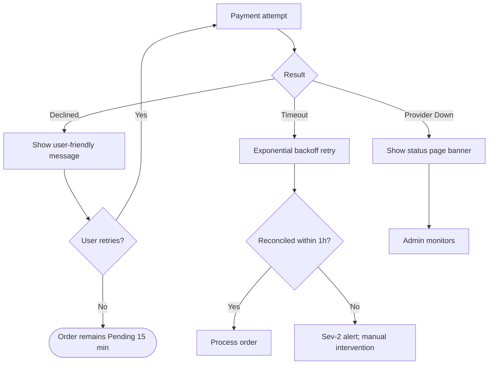

# ERROR_HANDLING.md — SmartLight

**Project:** SmartLight — Single Vendor E-Commerce Platform
**Document Version:** 1.0
**Status:** Draft
**Date:** 2026-07-03
**Author:** Principal System Analyst

This document defines the **error handling strategy** for SmartLight. It covers business errors, validation errors, authorization errors, payment errors, inventory errors, notification failures, AI service failures, and external service failures, along with retry and recovery strategies.

---

## 1. Error Taxonomy

All errors in SmartLight are categorized using the following hierarchy:

```
Error
├── ClientError (4xx)
│   ├── ValidationError (400)
│   ├── AuthenticationError (401)
│   ├── AuthorizationError (403)
│   ├── NotFoundError (404)
│   ├── ConflictError (409)
│   ├── BusinessRuleViolationError (422)
│   └── RateLimitError (429)
├── ServerError (5xx)
│   ├── InternalServerError (500)
│   ├── ServiceUnavailableError (503)
│   └── GatewayTimeoutError (504)
└── DomainError (business domain specific, mapped to 4xx/5xx)
    ├── InsufficientStockError (409)
    ├── PaymentDeclinedError (402)
    ├── VoucherInvalidError (422)
    ├── ReturnWindowExpiredError (422)
    ├── OrderStateTransitionError (409)
    └── WebhookSignatureError (401)
```

---

## 2. Standard Error Response Format

All API responses for errors follow a consistent JSON schema:

```json
{
  "error": {
    "code": "INSUFFICIENT_STOCK",
    "message": "Sản phẩm đã hết hàng hoặc không đủ số lượng",
    "details": {
      "variantId": "var_123",
      "requested": 2,
      "available": 1
    },
    "traceId": "req_abc123",
    "timestamp": "2026-07-03T10:00:00Z",
    "documentation": "https://docs.smartlight.vn/errors/INSUFFICIENT_STOCK"
  }
}
```

| Field | Description |
| --- | --- |
| `code` | Stable error code (uppercase, snake_case) |
| `message` | Human-readable message in Vietnamese (or English in admin) |
| `details` | Optional structured context |
| `traceId` | Request ID for log correlation |
| `timestamp` | ISO 8601 UTC |
| `documentation` | URL to error reference (Phase 4+) |

---

## 3. HTTP Status Code Mapping

| Status | When | Examples |
| --- | --- | --- |
| 200 | Success | Standard GET / PUT |
| 201 | Created | POST /orders |
| 204 | No content | DELETE |
| 400 | Validation error | Invalid email format |
| 401 | Not authenticated | Missing/invalid JWT |
| 402 | Payment required | Payment declined (per RFC 7231) |
| 403 | Forbidden | Permission denied |
| 404 | Not found | Product slug not found |
| 409 | Conflict | Insufficient stock; invalid state transition |
| 422 | Business rule violation | Voucher expired; return window expired |
| 429 | Rate limited | Too many login attempts |
| 500 | Internal server error | Unhandled exception |
| 502 | Bad gateway | Carrier API returned malformed response |
| 503 | Service unavailable | Planned maintenance |
| 504 | Gateway timeout | Provider API timeout |

---

## 4. Business Errors

### 4.1 Inventory Errors

| Error Code | HTTP | Vietnamese Message | Cause | Recovery |
| --- | --- | --- | --- | --- |
| `INSUFFICIENT_STOCK` | 409 | Sản phẩm đã hết hàng hoặc không đủ số lượng | Requested qty > available | Reduce qty; show available; suggest similar |
| `RESERVATION_EXPIRED` | 409 | Phiên giữ chỗ đã hết hạn | Cart reservation expired | Re-add to cart |
| `VARIANT_DISCONTINUED` | 410 | Sản phẩm đã ngừng kinh doanh | Variant is discontinued | Remove from cart; notify admin |
| `ADJUSTMENT_REQUIRES_REASON` | 422 | Vui lòng nhập lý do điều chỉnh | Stock adjustment missing reason | Re-submit with reason |
| `ADJUSTMENT_WOULD_NEGATIVE` | 422 | Không thể điều chỉnh về số âm | Stock decrement exceeds current | Reduce adjustment amount |

### 4.2 Payment Errors

| Error Code | HTTP | Vietnamese Message | Cause | Recovery |
| --- | --- | --- | --- | --- |
| `PAYMENT_DECLINED` | 402 | Thanh toán bị từ chối | Provider declined | Retry with same/alternative method |
| `PAYMENT_TIMEOUT` | 504 | Thanh toán hết thời gian | Provider did not respond | Retry; check order status |
| `WEBHOOK_SIGNATURE_INVALID` | 401 | Webhook signature không hợp lệ | HMAC verification failed | Reject; log; alert |
| `WEBHOOK_DUPLICATE` | 200 | OK | Duplicate event ID | Skip silently |
| `REFUND_WINDOW_EXPIRED` | 422 | Đã quá thời hạn hoàn tiền | Provider refund window passed | Manual bank transfer (admin) |
| `REFUND_AMOUNT_EXCEEDS` | 422 | Số tiền hoàn vượt quá | Refund > remaining refundable | Adjust amount |
| `IDEMPOTENCY_CONFLICT` | 409 | Request đã được xử lý | Same idempotency key with different body | Return original response |

### 4.3 Order State Errors

| Error Code | HTTP | Vietnamese Message | Cause | Recovery |
| --- | --- | --- | --- | --- |
| `ORDER_STATE_INVALID_TRANSITION` | 409 | Không thể chuyển trạng thái đơn hàng | Forbidden transition | Use allowed transition |
| `ORDER_TERMINAL_STATE` | 409 | Đơn hàng đã ở trạng thái cuối | Cannot transition from terminal | View history; initiate new order |
| `ORDER_ALREADY_CANCELLED` | 409 | Đơn hàng đã được hủy | Attempt to cancel already-cancelled | View order |
| `ORDER_NOT_CANCELLABLE` | 409 | Không thể hủy đơn hàng | Order in Shipped/Delivered state | Use return flow |

### 4.4 Voucher Errors

| Error Code | HTTP | Vietnamese Message | Cause | Recovery |
| --- | --- | --- | --- | --- |
| `VOUCHER_NOT_FOUND` | 404 | Mã voucher không tồn tại | Code does not exist | Check code |
| `VOUCHER_EXPIRED` | 422 | Mã voucher đã hết hạn | Now > endTime | Use another voucher |
| `VOUCHER_NOT_YET_ACTIVE` | 422 | Mã voucher chưa có hiệu lực | Now < startTime | Wait or use another |
| `VOUCHER_DEPLETED` | 422 | Mã voucher đã hết lượt sử dụng | usageCount >= limit | Use another |
| `VOUCHER_MIN_ORDER` | 422 | Đơn hàng chưa đạt giá trị tối thiểu | subtotal < minOrder | Add more items |
| `VOUCHER_NOT_ELIGIBLE` | 422 | Mã không áp dụng cho sản phẩm này | Items not in eligible set | Remove ineligible items |
| `VOUCHER_PER_USER_LIMIT` | 422 | Bạn đã sử dụng mã này | perUserCount >= limit | Use different account/code |
| `VOUCHER_STACKING` | 422 | Không thể kết hợp voucher | Stacking rules reject | Remove one |

### 4.5 Return Errors

| Error Code | HTTP | Vietnamese Message | Cause | Recovery |
| --- | --- | --- | --- | --- |
| `RETURN_WINDOW_EXPIRED` | 422 | Đã quá hạn trả hàng | DeliveredAt + 7 days passed | Contact support |
| `RETURN_ALREADY_REQUESTED` | 409 | Yêu cầu trả hàng đã tồn tại | Duplicate return request | View existing |
| `RETURN_NOT_APPROVED` | 409 | Yêu cầu chưa được duyệt | Cannot refund unapproved return | Wait for approval |
| `RETURN_INVALID_STATE` | 409 | Trạng thái trả hàng không hợp lệ | Cannot transition from current state | Follow state machine |

### 4.6 Authentication & Authorization Errors

| Error Code | HTTP | Vietnamese Message | Cause | Recovery |
| --- | --- | --- | --- | --- |
| `INVALID_CREDENTIALS` | 401 | Email hoặc mật khẩu không đúng | Bad login | Retry |
| `ACCOUNT_LOCKED` | 423 | Tài khoản bị khóa tạm thời | 5 failures | Wait 15 min or reset |
| `EMAIL_NOT_VERIFIED` | 403 | Vui lòng xác nhận email | Customer unverified | Resend verification |
| `MFA_REQUIRED` | 401 | Yêu cầu xác thực hai yếu tố | Admin without MFA | Setup MFA |
| `MFA_INVALID` | 401 | Mã xác thực không hợp lệ | Wrong TOTP | Retry |
| `PERMISSION_DENIED` | 403 | Bạn không có quyền thực hiện hành động này | Insufficient role | Contact admin |
| `TOKEN_EXPIRED` | 401 | Phiên đăng nhập hết hạn | JWT expired | Re-login |
| `TOKEN_INVALID` | 401 | Token không hợp lệ | Malformed JWT | Re-login |

---

## 5. Validation Errors

Validation errors occur when request data does not match the expected schema.

### 5.1 Format

```json
{
  "error": {
    "code": "VALIDATION_ERROR",
    "message": "Dữ liệu không hợp lệ",
    "details": {
      "fields": [
        {"field": "email", "message": "Email không hợp lệ", "code": "INVALID_EMAIL"},
        {"field": "password", "message": "Mật khẩu phải có ít nhất 8 ký tự", "code": "PWD_TOO_SHORT"}
      ]
    }
  }
}
```

### 5.2 Common Validation Codes

| Code | Description |
| --- | --- |
| `REQUIRED` | Field is required |
| `INVALID_EMAIL` | Email format invalid |
| `INVALID_PHONE_VN` | Vietnamese phone invalid (+84, 10 digits) |
| `PWD_TOO_SHORT` | < 8 chars |
| `PWD_TOO_WEAK` | Missing upper/digit/special |
| `INVALID_VND` | Negative or zero amount |
| `INVALID_DATE` | Date in past or malformed |
| `INVALID_SLUG` | Slug contains invalid chars |
| `OUT_OF_RANGE` | Value outside min/max |

### 5.3 Validation Strategy

- **Client-side:** First line of defense using Zod schemas (BR-CODING standards).
- **Server-side:** Authoritative validation at API boundary; rejects malformed payloads.
- **Database-level:** Final constraint (NOT NULL, FOREIGN KEY, CHECK).

---

## 6. Authorization Errors

When a user attempts an action they are not permitted to perform.

### 6.1 Detection

- **JWT validation:** Missing, malformed, expired token.
- **Role check:** User's role lacks required permission.
- **Object-level:** User accessing another user's resource.
- **MFA check:** Admin action requires valid MFA session.

### 6.2 Response

| Error Code | HTTP | Behavior |
| --- | --- | --- |
| `TOKEN_MISSING` | 401 | Return generic 401, do not reveal resource |
| `TOKEN_INVALID` | 401 | Same |
| `TOKEN_EXPIRED` | 401 | Same; suggest re-login |
| `PERMISSION_DENIED` | 403 | Return 403 with required permission |
| `MFA_REQUIRED` | 401 | Return 401 with `MFA_REQUIRED` code; client must prompt MFA |
| `MFA_INVALID` | 401 | Return 401; do not increment lockout (admin specific) |

### 6.3 Audit

All authorization failures are logged (BR-ADM-002):

```json
{
  "actor": "user_123",
  "action": "POST /api/admin/orders/ord_456/refund",
  "result": "DENIED",
  "reason": "INSUFFICIENT_ROLE",
  "ip": "203.0.113.45",
  "userAgent": "...",
  "timestamp": "..."
}
```

---

## 7. Payment Errors

Payment errors are special due to financial impact.

### 7.1 Categories

| Category | Examples |
| --- | --- |
| **User-induced** | Insufficient funds, expired card, wrong OTP |
| **Provider-induced** | Provider outage, API timeout, malformed response |
| **System-induced** | Misconfigured credentials, network partition |
| **Fraud** | Suspicious transaction pattern |

### 7.2 Specific Errors

| Error Code | HTTP | Vietnamese | Provider Code | Action |
| --- | --- | --- | --- | --- |
| `PAYMENT_DECLINED` | 402 | Thanh toán bị từ chối | Various | Show generic; allow retry |
| `PAYMENT_INSUFFICIENT_FUNDS` | 402 | Số dư không đủ | 51 / NSF | Show message; allow retry |
| `PAYMENT_CARD_EXPIRED` | 402 | Thẻ đã hết hạn | 54 / EXP | Show message; suggest other method |
| `PAYMENT_INVALID_CVV` | 402 | Mã CVV không đúng | N7 | Allow retry (3x) |
| `PAYMENT_FRAUD_SUSPECTED` | 402 | Giao dịch bị nghi ngờ | 59 / Fraud | Block; escalate to admin |
| `PAYMENT_PROVIDER_TIMEOUT` | 504 | Hết thời gian kết nối | Timeout | Retry with backoff; reconciliation |
| `PAYMENT_PROVIDER_UNAVAILABLE` | 503 | Dịch vụ thanh toán tạm ngưng | 5xx | Sev-1 alert; show status page |
| `PAYMENT_INVALID_CREDENTIALS` | 500 | Lỗi cấu hình thanh toán | Various | Sev-1 alert; admin must fix |

### 7.3 Payment Failure Recovery



---

## 8. Inventory Errors

| Error Code | HTTP | Recovery |
| --- | --- | --- |
| `INSUFFICIENT_STOCK` | 409 | Suggest max available; offer similar |
| `RESERVATION_EXPIRED` | 409 | Cart refreshed; re-add |
| `CONCURRENT_UPDATE` | 409 | Retry; serialize via lock |
| `NEGATIVE_STOCK` | 422 | Adjustments cannot result in negative |

### 8.1 Concurrent Reservation Race

When two users add the last unit simultaneously:

1. Both requests reach M-INV
2. First acquires `SELECT FOR UPDATE` lock
3. Second blocks
4. First creates reservation (success)
5. Second unblocks; sees stock = 0
6. Second receives `INSUFFICIENT_STOCK` (409)

---

## 9. Notification Failures

| Error Code | Type | Recovery |
| --- | --- | --- |
| `EMAIL_BOUNCE` | Soft/Hard | Mark email invalid; notify admin for hard bounce |
| `EMAIL_RATE_LIMIT` | Provider | Backoff queue |
| `EMAIL_INVALID_ADDRESS` | Hard | Log; flag account |
| `TEMPLATE_NOT_FOUND` | Bug | Sev-2 alert |
| `TEMPLATE_RENDER_ERROR` | Bug | Sev-2 alert; fallback to plain text |

### 9.1 Retry Strategy

```
BullMQ job retry policy:
- Attempts: 3
- Backoff: exponential
  - Attempt 1: immediate
  - Attempt 2: +1 minute
  - Attempt 3: +5 minutes
- Final: log + Sev-3 alert (admin notification)
```

---

## 10. AI Service Failures (V1.5+)

| Error Code | Recovery |
| --- | --- |
| `AI_TIMEOUT` | Fallback to search/canned answers |
| `AI_RATE_LIMIT` | Queue; degrade gracefully |
| `AI_HALLUCINATION_DETECTED` | (V1.5) Reject response; ask user to rephrase |
| `AI_QUOTA_EXCEEDED` | Disable feature flag; alert |

**V1.0 status:** AI features deferred to V1.5; this section is informational.

---

## 11. External Service Failures

### 11.1 Payment Gateway

| Failure | Strategy |
| --- | --- |
| Timeout | Retry 3x with exponential backoff |
| 5xx | Retry with backoff; Sev-1 alert if persistent |
| 4xx (provider config error) | Sev-1 alert; do not retry |
| Webhook delivery failure | Reconciliation cron |
| Provider outage | Status page banner; queue orders |

### 11.2 Shipping Carrier

| Failure | Strategy |
| --- | --- |
| Rate calculation timeout | Use fallback flat rate; retry |
| Label generation failure | Retry; admin alert if persistent |
| Tracking webhook missed | Polling fallback (hourly) |
| Carrier API down | Queue requests; degrade gracefully |

### 11.3 Email Service

| Failure | Strategy |
| --- | --- |
| Send timeout | Retry with backoff |
| Hard bounce | Mark email; notify admin |
| Soft bounce | Retry up to 3 days |
| Service outage | Queue jobs; status page |

### 11.4 Media CDN (Cloudinary)

| Failure | Strategy |
| --- | --- |
| Upload timeout | Client retries |
| Upload size exceeded | Reject at client |
| Variant generation failure | Retry; manual fallback |
| CDN down | Serve stale; degradation notice |

---

## 12. Retry Strategy Summary

| Operation | Retry Policy |
| --- | --- |
| **Webhook signature verify failure** | No retry (security) |
| **Webhook processing error** | 3 retries with exponential backoff (1s, 5s, 30s) |
| **Payment provider API** | 3 retries with exponential backoff (1s, 2s, 4s); then reconcile |
| **Email send** | 3 retries with backoff (1m, 5m, 30m) |
| **Carrier API** | 3 retries with backoff (2s, 10s, 60s) |
| **Cloudinary upload** | 2 retries with backoff (1s, 5s) |
| **Database deadlocks** | Automatic retry with backoff |
| **Idempotent operations** | Always safe to retry |

---

## 13. Recovery Strategy

### 13.1 Order Recovery

| Scenario | Recovery |
| --- | --- |
| Webhook missed | Hourly reconciliation (BR-PAY-010) |
| Payment failed but user charged | Manual reconciliation by Finance |
| Stock mismatch | Manual inventory adjustment with audit |
| Customer dispute | Return / refund flow |

### 13.2 Data Recovery

| Scenario | Recovery |
| --- | --- |
| Database backup | Daily automated + 30-day retention (NFR-AVAIL-004) |
| Accidental deletion | Soft-delete only; admin restore |
| Data corruption | Read replica fallback |
| Region failure | RTO ≤ 4 hours; RPO ≤ 1 hour |

### 13.3 Service Recovery

| Scenario | Recovery |
| --- | --- |
| Single instance down | Auto-restart; load balancer reroutes |
| All instances down | Runbook; status page |
| Provider outage | Multi-provider (V1.5+); for now, manual switch |

---

## 14. Error Monitoring and Alerting

| Severity | Trigger | Response |
| --- | --- | --- |
| **Sev-1** | Provider outage; data loss; security breach | Immediate page; all-hands |
| **Sev-2** | Persistent failed payments; webhook backlog; MFA bypass attempt | Page within 15 min |
| **Sev-3** | Email delivery failures; rate limit hits | Ticket; review daily |
| **Sev-4** | Validation errors; minor bugs | Logged; review weekly |

---

## 15. Error Logging Standards

All errors are logged with structured JSON:

```json
{
  "level": "ERROR",
  "timestamp": "2026-07-03T10:00:00Z",
  "service": "payment-service",
  "traceId": "req_abc123",
  "userId": "user_456",
  "error": {
    "code": "PAYMENT_DECLINED",
    "type": "PaymentDeclinedError",
    "message": "Card declined",
    "stack": "...",
    "context": {
      "orderId": "ord_789",
      "intentId": "pi_abc",
      "providerCode": "51"
    }
  },
  "request": {
    "method": "POST",
    "url": "/api/payments/intents",
    "ip": "203.0.113.45",
    "userAgent": "..."
  }
}
```

PII is **never** logged (BR-X-004):
- No full card numbers
- No CVV
- No password hashes
- Email/phone may be logged with hash for correlation

---

## 16. Error Code Reference (Quick Lookup)

| Domain | Codes |
| --- | --- |
| **General** | VALIDATION_ERROR, INTERNAL_ERROR, RATE_LIMITED |
| **Auth** | INVALID_CREDENTIALS, ACCOUNT_LOCKED, MFA_REQUIRED, MFA_INVALID, TOKEN_EXPIRED, TOKEN_INVALID, PERMISSION_DENIED, EMAIL_NOT_VERIFIED |
| **Catalog** | PRODUCT_NOT_FOUND, VARIANT_NOT_FOUND, CATEGORY_NOT_FOUND, DUPLICATE_SKU, IMAGE_TOO_LARGE, IMAGE_INVALID_TYPE |
| **Inventory** | INSUFFICIENT_STOCK, RESERVATION_EXPIRED, VARIANT_DISCONTINUED, ADJUSTMENT_REQUIRES_REASON, ADJUSTMENT_WOULD_NEGATIVE |
| **Payment** | PAYMENT_DECLINED, PAYMENT_TIMEOUT, WEBHOOK_SIGNATURE_INVALID, REFUND_WINDOW_EXPIRED, REFUND_AMOUNT_EXCEEDS, IDEMPOTENCY_CONFLICT |
| **Order** | ORDER_STATE_INVALID_TRANSITION, ORDER_TERMINAL_STATE, ORDER_ALREADY_CANCELLED, ORDER_NOT_CANCELLABLE |
| **Voucher** | VOUCHER_NOT_FOUND, VOUCHER_EXPIRED, VOUCHER_DEPLETED, VOUCHER_MIN_ORDER, VOUCHER_NOT_ELIGIBLE, VOUCHER_PER_USER_LIMIT, VOUCHER_STACKING |
| **Return** | RETURN_WINDOW_EXPIRED, RETURN_ALREADY_REQUESTED, RETURN_NOT_APPROVED |
| **Notification** | EMAIL_BOUNCE, EMAIL_INVALID_ADDRESS, TEMPLATE_NOT_FOUND |

---

## 17. Document Control

| Version | Date | Author | Change Summary |
| --- | --- | --- | --- |
| 1.0 | 2026-07-03 | Principal System Analyst | Initial error handling strategy: taxonomy, response format, business errors, validation, authorization, payment, inventory, notification, AI, external service failures, retry, recovery, monitoring |

---

**End of Document — ERROR_HANDLING.md**