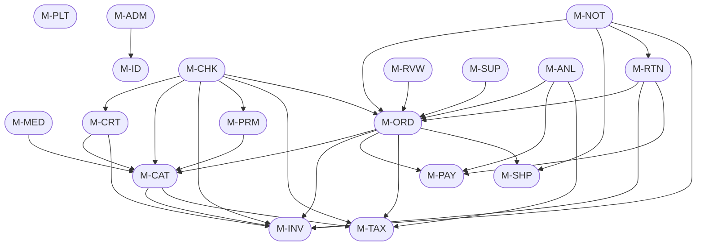

# MODULE_INTERACTION.md — SmartLight

**Project:** SmartLight — Single Vendor E-Commerce Platform
**Document Version:** 1.0
**Status:** Draft
**Date:** 2026-07-03
**Author:** Principal System Analyst

This document defines the SmartLight **modular monolith** internal structure: each module's responsibilities, dependencies, events emitted/consumed, shared objects, ownership, coupling, and future microservice boundary.

The architecture is **Modular Monolith** with strict internal boundaries. Each module has its own folder, its own NestJS module, and its own database tables (one schema or table-prefix per module). Modules communicate through:
1. **Direct method calls** (synchronous, in-process) for transactional flows.
2. **Domain Events** (asynchronous, in-process via `@nestjs/event-emitter` in V1.0; future Kafka/RabbitMQ when extracted).

---

## 1. Module Inventory

| ID | Module | Description |
| --- | --- | --- |
| M-CAT | Catalog | Products, variants, categories, attributes |
| M-INV | Inventory | Stock-on-hand, reservations, adjustments |
| M-MED | Media | Image upload, optimization, retrieval |
| M-CRT | Cart | Cart lines, guest cart, wishlist |
| M-CHK | Checkout | Checkout session orchestration |
| M-PRM | Promotion | Promotions, vouchers |
| M-TAX | Tax | VAT calculation, exempt categories |
| M-ORD | Order | Order lifecycle, history |
| M-PAY | Payment | Payment intents, webhooks, refunds |
| M-SHP | Shipping | Shipping zones, labels, tracking |
| M-RTN | Returns | RMA, inspection, restock |
| M-RVW | Reviews | Reviews, ratings, moderation |
| M-ID | Identity | Auth, accounts, MFA |
| M-ADM | Admin | Admin users, roles, audit |
| M-NOT | Notifications | Email queue, templates |
| M-SUP | Support | Tickets, replies |
| M-ANL | Analytics | Reports, exports |
| M-PLT | Platform | Health, version, feature flags, static pages |

Total: **18 modules**.

---

## 2. Per-Module Specification

### 2.1 M-CAT — Catalog

| Aspect | Detail |
| --- | --- |
| **Responsibilities** | Product CRUD; variant CRUD; category hierarchy; attribute schema; SEO metadata; product search |
| **Owns Tables** | `products`, `product_variants`, `categories`, `attributes`, `product_attribute_values` |
| **Owns API** | `/api/catalog/*`, `/api/storefront/products/*`, `/api/storefront/categories/*` |
| **Depends On** | M-MED (for image references), M-INV (for stock), M-TAX (for category tax flag) |
| **Emits Events** | `ProductCreated`, `ProductUpdated`, `ProductPublished`, `ProductDeleted` |
| **Consumes Events** | `MediaUploaded` (to associate images with product) |
| **Shared Objects** | `ProductSummary`, `ProductDetail`, `Variant` (DTOs) |
| **Coupling** | Loose via events; tight via direct call for cart price computation |
| **Future Microservice Boundary** | Pure `CatalogService` with own DB; events via Kafka topic `catalog.*` |

### 2.2 M-INV — Inventory

| Aspect | Detail |
| --- | --- |
| **Responsibilities** | Stock-on-hand, reservations (15-min), low-stock alerts, manual adjustments, restock on return |
| **Owns Tables** | `inventory_stock`, `inventory_reservations`, `inventory_adjustments`, `inventory_movements` |
| **Owns API** | `/api/admin/inventory/*`, internal hooks for M-CRT, M-CHK, M-ORD |
| **Depends On** | M-CAT (for variant IDs) |
| **Emits Events** | `StockReserved`, `ReservationReleased`, `StockDecremented`, `StockIncremented`, `LowStockDetected` |
| **Consumes Events** | `OrderConfirmed` (decrement), `OrderCancelled` (release reservation), `ReturnInspected` (restock/dispose) |
| **Shared Objects** | `StockLevel`, `Reservation` (DTOs) |
| **Coupling** | Tight inbound from Order/Cart (synchronous call to reserve/decrement) |
| **Future Microservice Boundary** | Pure `InventoryService`; events to Catalog for "in stock" display cache |

### 2.3 M-MED — Media

| Aspect | Detail |
| --- | --- |
| **Responsibilities** | Image upload (signed), optimization (variants), retrieval (CDN URLs), reordering |
| **Owns Tables** | `media_assets`, `media_variant_mappings` |
| **Owns API** | `/api/admin/media/sign-upload`, `/api/admin/media/attach` |
| **Depends On** | A-MEDIA-CDN (external) |
| **Emits Events** | `MediaUploaded`, `MediaVariantsGenerated`, `MediaDeleted` |
| **Consumes Events** | None (pure service) |
| **Shared Objects** | `MediaAsset`, `ImageVariantSet` (DTOs) |
| **Coupling** | Loose — pure service called by M-CAT |
| **Future Microservice Boundary** | Pure `MediaService` with own storage; could even be replaced by external DAM |

### 2.4 M-CRT — Cart

| Aspect | Detail |
| --- | --- |
| **Responsibilities** | Cart line CRUD; guest cart (cookie + DB); merge on login; wishlist (V1.1) |
| **Owns Tables** | `carts`, `cart_lines`, `wishlists` |
| **Owns API** | `/api/storefront/cart/*` |
| **Depends On** | M-CAT (for product/variant data), M-INV (for stock check + reservation) |
| **Emits Events** | `CartLineAdded`, `CartLineRemoved`, `CartUpdated` |
| **Consumes Events** | None |
| **Shared Objects** | `Cart`, `CartLine` (DTOs) |
| **Coupling** | Tight to M-INV for stock; tight to M-CAT for prices |
| **Future Microservice Boundary** | `CartService`; needs session affinity or external store (Redis) for guest carts |

### 2.5 M-CHK — Checkout

| Aspect | Detail |
| --- | --- |
| **Responsibilities** | Multi-step checkout orchestration; idempotency; address capture; shipping selection; payment selection; order creation trigger |
| **Owns Tables** | `checkout_sessions` |
| **Owns API** | `/api/storefront/checkout/*` |
| **Depends On** | M-CRT, M-CAT, M-INV, M-PRM, M-TAX, M-ORD, M-PAY |
| **Emits Events** | `CheckoutStarted`, `CheckoutCompleted` |
| **Consumes Events** | None |
| **Shared Objects** | `CheckoutSession`, `CheckoutPreview` |
| **Coupling** | Orchestrator; touches many modules |
| **Future Microservice Boundary** | Stays in BFF (Backend-for-Frontend); orchestrates other microservices |

### 2.6 M-PRM — Promotion

| Aspect | Detail |
| --- | --- |
| **Responsibilities** | Promotion CRUD; voucher codes; eligibility rules; usage tracking; flash sales |
| **Owns Tables** | `promotions`, `vouchers`, `promotion_usages` |
| **Owns API** | `/api/admin/promotions/*`, `/api/storefront/vouchers/*` |
| **Depends On** | M-CAT (eligibility), M-CHK (apply at checkout) |
| **Emits Events** | `PromotionActivated`, `PromotionDeactivated`, `VoucherRedeemed` |
| **Consumes Events** | `OrderConfirmed` (increment voucher usage) |
| **Shared Objects** | `DiscountResult` (DTO: `{amount, appliedTo, voucherCode}`) |
| **Coupling** | Loose via events |
| **Future Microservice Boundary** | Pure `PromotionService`; voucher codes highly cacheable |

### 2.7 M-TAX — Tax

| Aspect | Detail |
| --- | --- |
| **Responsibilities** | VAT calculation per line; exempt categories; VAT snapshot at sale; VAT reporting |
| **Owns Tables** | `tax_categories`, `tax_rates`, `tax_reports` |
| **Owns API** | `/api/admin/tax/*`, internal hook for M-ORD |
| **Depends On** | M-CAT (category flags) |
| **Emits Events** | `TaxExemptionMarked`, `TaxRateChanged` |
| **Consumes Events** | None |
| **Shared Objects** | `TaxComputation` (DTO) |
| **Coupling** | Internal calculation; very tight to Order for snapshot |
| **Future Microservice Boundary** | Stay integrated (small, high-frequency) |

### 2.8 M-ORD — Order

| Aspect | Detail |
| --- | --- |
| **Responsibilities** | Order lifecycle (state machine); order history; invoice generation; cancellation |
| **Owns Tables** | `orders`, `order_lines`, `order_status_history`, `order_addresses` |
| **Owns API** | `/api/storefront/orders/*`, `/api/admin/orders/*` |
| **Depends On** | M-CAT, M-INV, M-PAY, M-TAX, M-SHP, M-CUSTOMER (M-ID) |
| **Emits Events** | `OrderCreated`, `OrderConfirmed`, `OrderCancelled`, `OrderDelivered`, `OrderCompleted` |
| **Consumes Events** | `PaymentCaptured` (transition to Confirmed), `ShipmentDelivered` (transition to Delivered) |
| **Shared Objects** | `Order`, `OrderLine`, `OrderHistory` |
| **Coupling** | High central importance; downstream of many modules |
| **Future Microservice Boundary** | Pure `OrderService`; possibly the largest microservice in V2 |

### 2.9 M-PAY — Payment

| Aspect | Detail |
| --- | --- |
| **Responsibilities** | Payment intent creation; webhook reception; refund; reconciliation |
| **Owns Tables** | `payment_intents`, `payments`, `refunds`, `webhook_events` |
| **Owns API** | `/api/payments/webhook`, `/api/admin/payments/*` |
| **Depends On** | A-PAYMENT-GW (external) |
| **Emits Events** | `PaymentAuthorized`, `PaymentCaptured`, `PaymentFailed`, `RefundCompleted` |
| **Consumes Events** | `OrderCreated` (create intent), `ReturnApproved` (initiate refund) |
| **Shared Objects** | `PaymentIntent`, `Refund` |
| **Coupling** | Tight to Order (state machine coupling) |
| **Future Microservice Boundary** | Pure `PaymentService`; high PCI scope; isolated network zone |

### 2.10 M-SHP — Shipping

| Aspect | Detail |
| --- | --- |
| **Responsibilities** | Shipping zones; rate calculation; shipment creation; label generation; tracking sync |
| **Owns Tables** | `shipping_zones`, `shipments`, `tracking_events` |
| **Owns API** | `/api/storefront/shipping/rates`, `/api/admin/shipments/*` |
| **Depends On** | A-SHIPPING-PROV (external) |
| **Emits Events** | `ShipmentCreated`, `ShipmentDispatched`, `ShipmentDelivered`, `ShipmentLost` |
| **Consumes Events** | `OrderProcessingStarted` (create shipment) |
| **Shared Objects** | `Shipment`, `TrackingEvent` |
| **Coupling** | Tight to Order for status transitions |
| **Future Microservice Boundary** | Pure `ShippingService`; potentially multiple carrier adapters |

### 2.11 M-RTN — Returns

| Aspect | Detail |
| --- | --- |
| **Responsibilities** | RMA creation; approval/rejection; inspection; restock/dispose; refund linkage |
| **Owns Tables** | `returns`, `return_items`, `return_inspections` |
| **Owns API** | `/api/storefront/returns/*`, `/api/admin/returns/*` |
| **Depends On** | M-ORD (order reference), M-INV (restock), M-PAY (refund) |
| **Emits Events** | `ReturnRequested`, `ReturnApproved`, `ReturnRejected`, `ReturnInspected`, `ReturnRefunded` |
| **Consumes Events** | `OrderDelivered` (allow return window) |
| **Shared Objects** | `Return`, `ReturnItem` |
| **Coupling** | Multi-module orchestration |
| **Future Microservice Boundary** | Pure `ReturnsService`; tightly integrated with Order |

### 2.12 M-RVW — Reviews

| Aspect | Detail |
| --- | --- |
| **Responsibilities** | Review submission; moderation; aggregated ratings; helpful votes |
| **Owns Tables** | `reviews`, `review_helpful_votes` |
| **Owns API** | `/api/storefront/reviews/*`, `/api/admin/reviews/*` |
| **Depends On** | M-ORD (verified purchase check) |
| **Emits Events** | `ReviewSubmitted`, `ReviewApproved`, `ReviewRejected` |
| **Consumes Events** | `OrderCompleted` (enable review submission) |
| **Shared Objects** | `Review`, `RatingSummary` |
| **Coupling** | Loose via events |
| **Future Microservice Boundary** | Pure `ReviewsService`; high read traffic; cache-friendly |

### 2.13 M-ID — Identity

| Aspect | Detail |
| --- | --- |
| **Responsibilities** | Registration; login; password reset; MFA setup/recovery; profile; addresses; account deletion |
| **Owns Tables** | `customers`, `admin_users`, `admin_roles`, `admin_user_roles`, `addresses`, `mfa_secrets`, `sessions`, `refresh_tokens` |
| **Owns API** | `/api/auth/*`, `/api/storefront/account/*`, `/api/admin/account/*` |
| **Depends On** | A-EMAIL-SVC (verification emails) |
| **Emits Events** | `CustomerRegistered`, `CustomerLoggedIn`, `CustomerLoggedOut`, `AdminLoggedIn`, `MFAEnabled` |
| **Consumes Events** | None |
| **Shared Objects** | `AuthContext`, `Principal` |
| **Coupling** | Loosely coupled (JWT validation only) |
| **Future Microservice Boundary** | Pure `IdentityService`; OAuth2/OIDC provider in V2 |

### 2.14 M-ADM — Admin

| Aspect | Detail |
| --- | --- |
| **Responsibilities** | Admin user CRUD; role assignment; audit log query; feature flag configuration |
| **Owns Tables** | `audit_logs`, `feature_flags`, `feature_flag_overrides` |
| **Owns API** | `/api/admin/admin-users/*`, `/api/admin/audit/*`, `/api/admin/feature-flags/*` |
| **Depends On** | M-ID (admin user data) |
| **Emits Events** | `FeatureFlagChanged` |
| **Consumes Events** | All sensitive operations emit audit log writes (consumed by middleware) |
| **Shared Objects** | `AuditEntry`, `FeatureFlag` |
| **Coupling** | Cross-cutting audit; isolated feature-flag service |
| **Future Microservice Boundary** | Audit goes to SIEM in V2; FeatureFlag stays as sidecar |

### 2.15 M-NOT — Notifications

| Aspect | Detail |
| --- | --- |
| **Responsibilities** | Email queue (BullMQ); template rendering; retry logic; bounce handling |
| **Owns Tables** | `email_templates`, `notification_logs`, `notification_jobs` (in Redis) |
| **Owns API** | `/api/admin/email-templates/*` |
| **Depends On** | A-EMAIL-SVC (external) |
| **Emits Events** | `NotificationSent`, `NotificationFailed` |
| **Consumes Events** | `OrderConfirmed`, `OrderShipped`, `OrderDelivered`, `OrderCompleted`, `ReturnApproved`, `RefundCompleted`, `LowStockDetected` |
| **Shared Objects** | `NotificationJob`, `RenderedEmail` |
| **Coupling** | Subscriber to many domains |
| **Future Microservice Boundary** | Pure `NotificationService`; horizontally scalable; standard pattern |

### 2.16 M-SUP — Support

| Aspect | Detail |
| --- | --- |
| **Responsibilities** | Ticket CRUD; response; resolution; internal notes |
| **Owns Tables** | `tickets`, `ticket_messages` |
| **Owns API** | `/api/storefront/tickets/*`, `/api/admin/tickets/*` |
| **Depends On** | M-ORD (link ticket to order) |
| **Emits Events** | `TicketCreated`, `TicketResolved`, `TicketClosed` |
| **Consumes Events** | None |
| **Shared Objects** | `Ticket`, `TicketMessage` |
| **Coupling** | Loose via optional order reference |
| **Future Microservice Boundary** | Pure `SupportService`; integration with helpdesk in V2 |

### 2.17 M-ANL — Analytics

| Aspect | Detail |
| --- | --- |
| **Responsibilities** | Sales reports; product performance; VAT report; CSV export |
| **Owns Tables** | Read-only views over orders, order_lines, payments, returns |
| **Owns API** | `/api/admin/reports/*` |
| **Depends On** | M-ORD, M-PAY, M-TAX (read-only) |
| **Emits Events** | None |
| **Consumes Events** | Reads directly from DB or via event-sourced projections |
| **Shared Objects** | `SalesReport`, `VatReport` |
| **Coupling** | Read-only; very loose |
| **Future Microservice Boundary** | Move to dedicated data warehouse + BI in V2 |

### 2.18 M-PLT — Platform

| Aspect | Detail |
| --- | --- |
| **Responsibilities** | Health/version endpoints; sitemap; static pages; cookie consent |
| **Owns Tables** | `static_pages`, `cookie_consent_log` |
| **Owns API** | `/health`, `/version`, `/sitemap.xml`, `/api/storefront/pages/*` |
| **Depends On** | None |
| **Emits Events** | None |
| **Consumes Events** | None |
| **Shared Objects** | None |
| **Coupling** | Pure cross-cutting |
| **Future Microservice Boundary** | Stays as shared library / sidecar |

---

## 3. Dependency Graph (Module-Level)

---

## 4. Event Catalog (Domain Events)

| Event | Producer | Consumers | Payload |
| --- | --- | --- | --- |
| `ProductPublished` | M-CAT | M-NOT (cache invalidation), Search index | `{productId, slug}` |
| `MediaUploaded` | M-MED | M-CAT | `{assetId, productId}` |
| `StockReserved` | M-INV | M-CRT | `{variantId, qty, reservationId}` |
| `StockDecremented` | M-INV | M-CAT (cache invalidate) | `{variantId, newOnHand}` |
| `LowStockDetected` | M-INV | M-NOT (admin email), M-CAT (badge) | `{variantId, currentStock, threshold}` |
| `ReservationExpired` | M-INV | M-CRT (cart update) | `{reservationId, variantId}` |
| `CartMerged` | M-CRT | M-NOT (optional email) | `{customerId, linesAdded}` |
| `CheckoutStarted` | M-CHK | M-NOT (analytics) | `{sessionId, customerId?}` |
| `CheckoutCompleted` | M-CHK | M-NOT (analytics) | `{sessionId, orderId}` |
| `OrderCreated` | M-ORD | M-PAY (intent), M-NOT (analytics) | `{orderId, amount}` |
| `OrderConfirmed` | M-ORD | M-NOT (email), M-INV (already decremented) | `{orderId}` |
| `OrderCancelled` | M-ORD | M-INV (release), M-PAY (void), M-NOT (email) | `{orderId, reason}` |
| `OrderShipped` | M-SHP | M-ORD (transition), M-NOT (email) | `{orderId, trackingNumber}` |
| `OrderDelivered` | M-SHP | M-ORD (transition), M-NOT (email) | `{orderId, deliveredAt}` |
| `OrderCompleted` | M-ORD | M-NOT (email), M-RVW (enable review) | `{orderId}` |
| `PaymentCaptured` | M-PAY | M-ORD (transition), M-NOT (email) | `{orderId, paymentId}` |
| `PaymentFailed` | M-PAY | M-ORD (cancel), M-NOT (email) | `{orderId, reason}` |
| `RefundCompleted` | M-PAY | M-ORD, M-RTN (close return), M-NOT (email) | `{refundId, orderId, amount}` |
| `VoucherRedeemed` | M-PRM | M-NOT (analytics) | `{voucherCode, customerId}` |
| `ReturnRequested` | M-RTN | M-NOT (email) | `{returnId, customerId}` |
| `ReturnApproved` | M-RTN | M-PAY (initiate refund), M-NOT (email) | `{returnId}` |
| `ReturnInspected` | M-RTN | M-INV (restock/dispose) | `{returnId, outcome, items}` |
| `ReviewSubmitted` | M-RVW | M-NOT (notify admin) | `{reviewId, productId}` |
| `TicketCreated` | M-SUP | M-NOT (notify support) | `{ticketId, customerId}` |
| `CustomerRegistered` | M-ID | M-NOT (welcome email) | `{customerId}` |
| `MFAEnabled` | M-ID | M-NOT (confirmation email) | `{userId}` |
| `FeatureFlagChanged` | M-ADM | All modules (cache invalidation) | `{flagKey, value}` |

---

## 5. Shared Objects (Cross-Module DTOs)

These DTOs are passed between modules to decouple them.

| DTO | Defined In | Used By |
| --- | --- | --- |
| `Money` | Common | All money-handling modules (BR-X-001) |
| `Address` | Common | M-ID, M-CHK, M-ORD |
| `ProductSummary` | M-CAT | M-CRT, M-CHK, M-ORD |
| `Variant` | M-CAT | M-CRT, M-INV, M-CHK |
| `StockLevel` | M-INV | M-CAT (display), M-CRT (validation) |
| `TaxComputation` | M-TAX | M-CHK, M-ORD |
| `DiscountResult` | M-PRM | M-CHK |
| `OrderSummary` | M-ORD | M-CUST (UI), M-NOT (email) |
| `PaymentIntent` | M-PAY | M-ORD, M-CHK |
| `Principal` | M-ID | All (authorization) |

---

## 6. Module Ownership Matrix

| Module | Owner Team | On-Call | SLA |
| --- | --- | --- | --- |
| M-ID | Platform | Platform | 24/7 |
| M-CAT | Catalog | Catalog | 24/7 |
| M-INV | Catalog | Catalog | 24/7 |
| M-MED | Catalog | Catalog | 24/7 |
| M-CRT | Storefront | Storefront | 24/7 |
| M-CHK | Storefront | Storefront | 24/7 |
| M-ORD | Storefront | Storefront | 24/7 |
| M-PAY | Platform | Platform | 24/7 |
| M-SHP | Storefront | Storefront | 24/7 |
| M-RTN | Storefront | Storefront | Business hours |
| M-RVW | Catalog | Catalog | Business hours |
| M-PRM | Marketing | Marketing | Business hours |
| M-TAX | Platform | Platform | 24/7 |
| M-NOT | Platform | Platform | Business hours |
| M-SUP | Support | Support | Business hours |
| M-ANL | Finance | Finance | Business hours |
| M-ADM | Platform | Platform | 24/7 |
| M-PLT | Platform | Platform | 24/7 |

---

## 7. Coupling Classification

| Module Pair | Coupling Type | Notes |
| --- | --- | --- |
| M-CAT ↔ M-INV | Domain (medium) | Variant × stock join; consider separate query service in V2 |
| M-CRT ↔ M-INV | Domain (high) | Tight real-time coupling for reservations |
| M-CHK ↔ M-ORD | Application (high) | Orchestrator-consumer; cannot decouple without orchestration service |
| M-ORD ↔ M-PAY | Domain (high) | State machine coupling |
| M-ORD ↔ M-SHP | Domain (medium) | Status transitions |
| M-RTN ↔ M-ORD | Domain (high) | RMA references order |
| M-RTN ↔ M-INV | Domain (medium) | Restock event |
| M-RTN ↔ M-PAY | Domain (medium) | Refund trigger |
| M-NOT ↔ All | Event (loose) | Pure subscriber |
| M-ANL ↔ All | Read-only (loose) | Read-only views |
| M-ADM ↔ All | Cross-cutting | Audit + feature flags |

---

## 8. Future Microservice Extraction Plan

### V2 Microservices Candidates

| Microservice | Source Modules | Justification |
| --- | --- | --- |
| **IdentityService** | M-ID | OAuth2/OIDC standard; reusability |
| **CatalogService** | M-CAT + M-MED | High read traffic; cacheable |
| **InventoryService** | M-INV | Tight real-time consistency; scale independently |
| **OrderService** | M-ORD + M-CHK + M-CRT | Largest domain; bottleneck |
| **PaymentService** | M-PAY | PCI scope isolation; security zone |
| **ShippingService** | M-SHP | Carrier integrations; external |
| **NotificationService** | M-NOT | Standard horizontal scaling |

### V2 Stay-Integrated (Library / Sidecar)

| Module | Reason |
| --- | --- |
| M-PRM | Tight to cart/order; low traffic |
| M-TAX | Internal calculation; high frequency |
| M-RVW | Low traffic; integrated with catalog |
| M-RTN | Tight to order; small |
| M-SUP | Small; integrated |
| M-ANL | Move to data warehouse (separate from runtime) |
| M-ADM | Audit → SIEM; feature flags → sidecar |
| M-PLT | Cross-cutting library |

---

## 9. Document Control

| Version | Date | Author | Change Summary |
| --- | --- | --- | --- |
| 1.0 | 2026-07-03 | Principal System Analyst | Initial module interaction model: 18 modules, dependencies, events, shared objects, future microservice boundaries |

---

**End of Document — MODULE_INTERACTION.md**