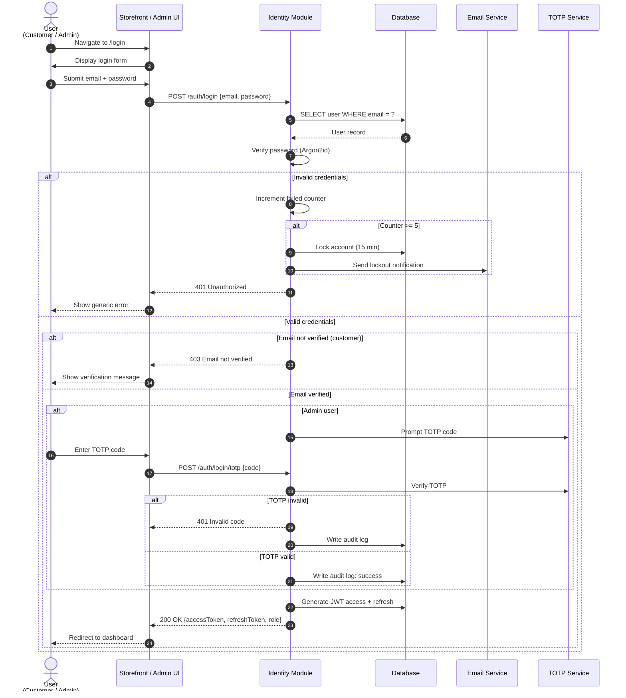
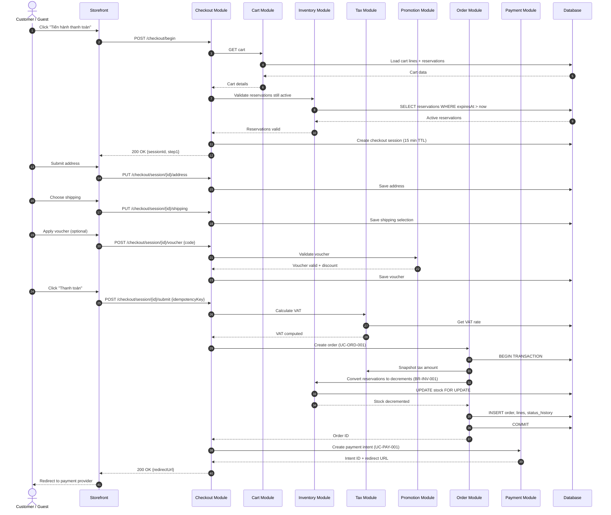
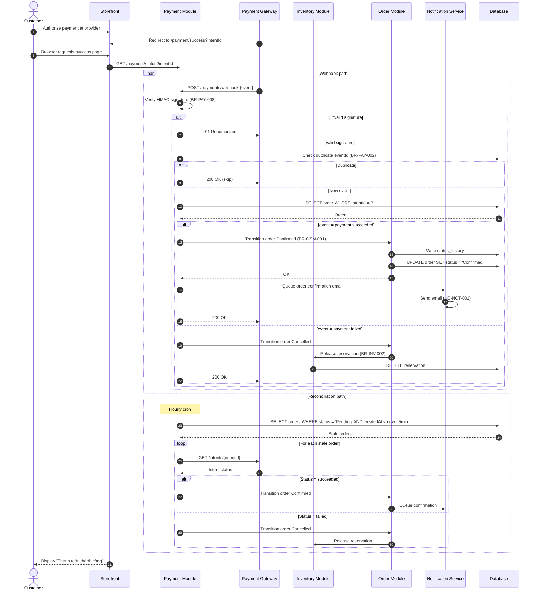
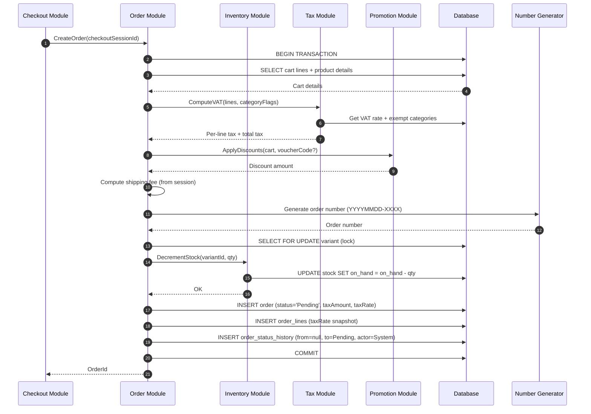
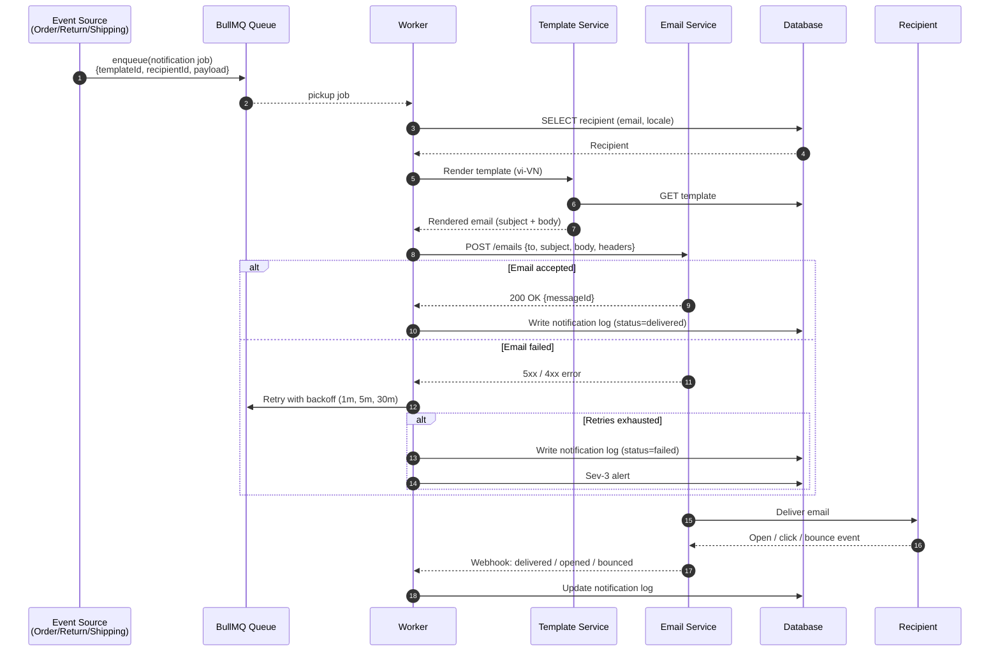
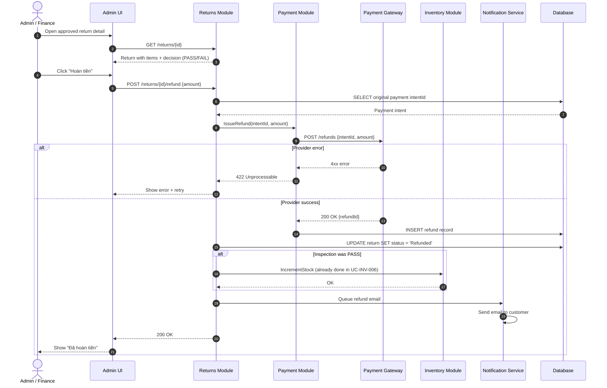
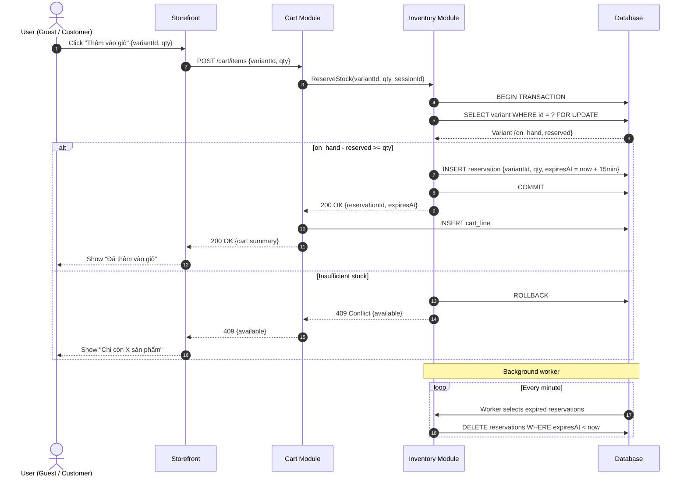
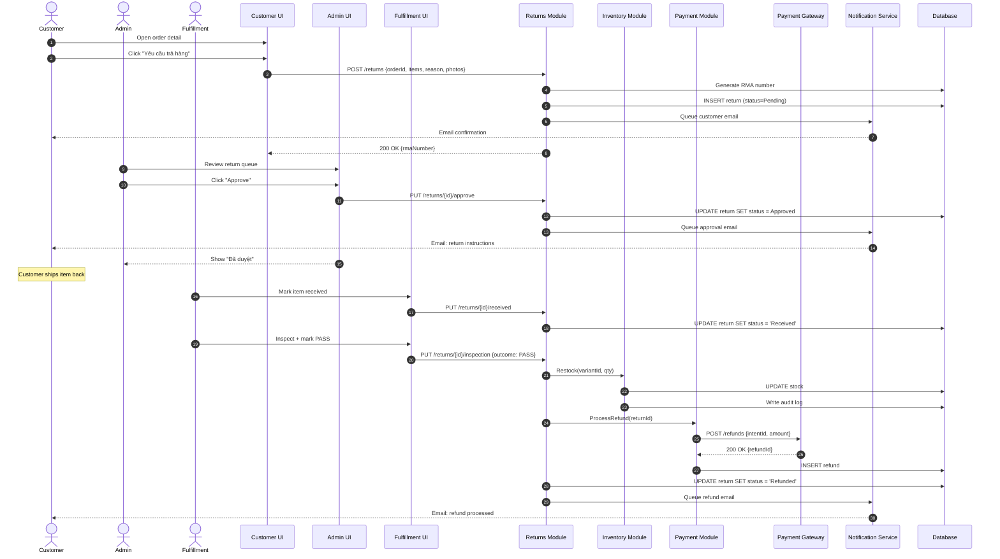

# SEQUENCE_DIAGRAMS.md — SmartLight

**Project:** SmartLight — Single Vendor E-Commerce Platform
**Document Version:** 1.0
**Status:** Draft
**Date:** 2026-07-03
**Author:** Principal System Analyst

This document contains **sequence diagrams** for the critical SmartLight workflows. All diagrams use **Mermaid** syntax. Each diagram represents the interaction between actors, the system, and external services.

---

## 1. SD-01 — Login Sequence

**References:** UC-ID-002, BR-ID-005, BR-ID-013, BR-MFA-001

---

## 2. SD-02 — Checkout Sequence

**References:** UC-CHK-001..008, UC-ORD-001, UC-PAY-001, BR-CHK-007, BR-INV-001, BR-TAX-001..005

---

## 3. SD-03 — Payment Sequence

**References:** UC-PAY-001..005, BR-PAY-002, BR-PAY-007, BR-PAY-008, BR-PAY-010, BR-OSM-001

---

## 4. SD-04 — Order Creation Sequence

**References:** UC-ORD-001, BR-ORD-001, BR-ORD-002, BR-INV-001, BR-TAX-004, BR-TAX-005, BR-OSM-003

---

## 5. SD-05 — Notification Sequence

**References:** UC-NOT-001, BR-NOT-001..004, NFR-AVAIL-002

---

## 6. SD-06 — Refund Sequence

**References:** UC-RTN-005, UC-PAY-005, BR-PAY-009, BR-RTN-006, BR-INV-006

---

## 7. SD-07 — Inventory Reservation Sequence

**References:** UC-INV-002, UC-INV-003, BR-INV-002, BR-INV-003, BR-INV-007

---

## 8. SD-08 — Return Request to Refund (End-to-End)

**References:** UC-RTN-001..005, UC-PAY-005, UC-INV-006, BR-RTN-001..007, BR-INV-006, BR-PAY-009

---

## 9. Sequence Diagram Coverage Matrix

| Sequence Diagram | Use Cases | Business Rules | Features |
| --- | --- | --- | --- |
| SD-01 Login | UC-ID-002 | BR-ID-005, BR-ID-013, BR-MFA-001 | SF-ID-004..005, SF-ID-011..013 |
| SD-02 Checkout | UC-CHK-001..008 | BR-CHK-007, BR-INV-001, BR-TAX-001..005 | SF-CHK-001..011 |
| SD-03 Payment | UC-PAY-001..005 | BR-PAY-002, BR-PAY-007, BR-PAY-008, BR-PAY-010 | SF-PAY-001..005 |
| SD-04 Order Creation | UC-ORD-001 | BR-ORD-001, BR-INV-001, BR-TAX-004 | SF-ORD-001, SF-TAX-001 |
| SD-05 Notification | UC-NOT-001 | BR-NOT-001..004 | SF-NOT-001..005 |
| SD-06 Refund | UC-PAY-005, UC-RTN-005 | BR-PAY-009, BR-RTN-006 | SF-PAY-004, SF-RTN-006 |
| SD-07 Inventory Reservation | UC-INV-002, UC-INV-003 | BR-INV-002, BR-INV-003, BR-INV-007 | SF-INV-001, SF-INV-002 |
| SD-08 Return E2E | UC-RTN-001..005 | BR-RTN-001..007, BR-INV-006, BR-PAY-009 | SF-RTN-001..006, SF-PAY-004 |

---

## 10. Document Control

| Version | Date | Author | Change Summary |
| --- | --- | --- | --- |
| 1.0 | 2026-07-03 | Principal System Analyst | Initial 8 sequence diagrams in Mermaid syntax; coverage matrix |

---

**End of Document — SEQUENCE_DIAGRAMS.md**