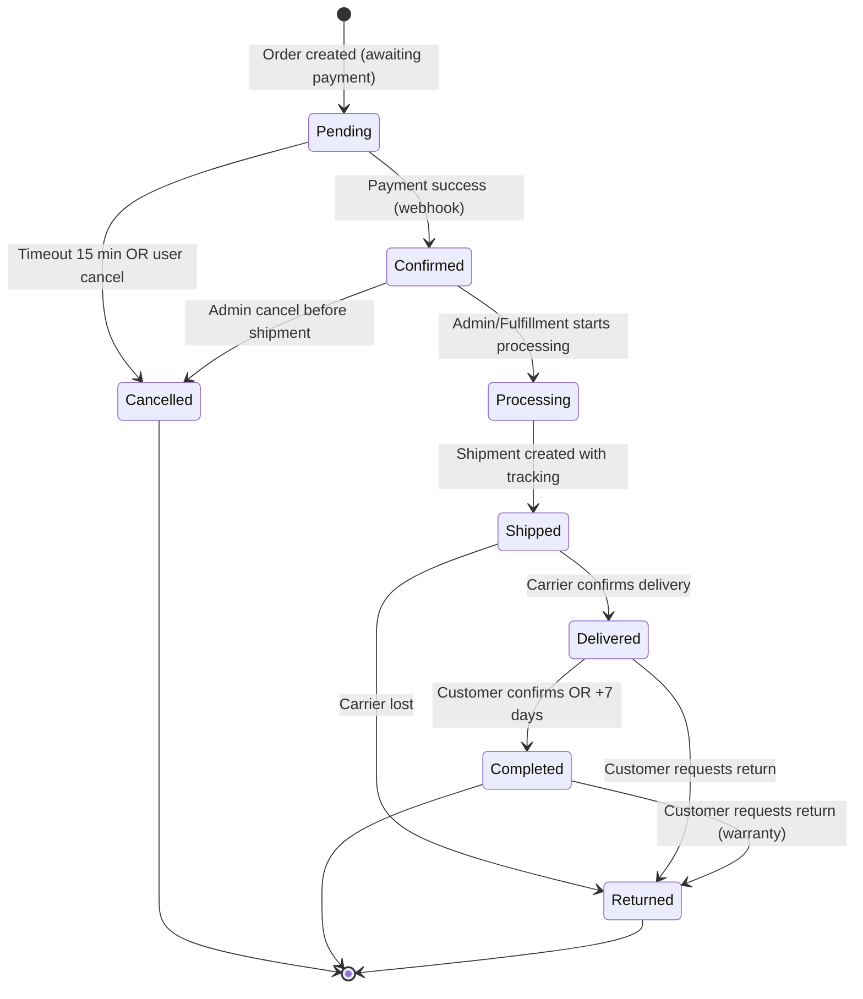
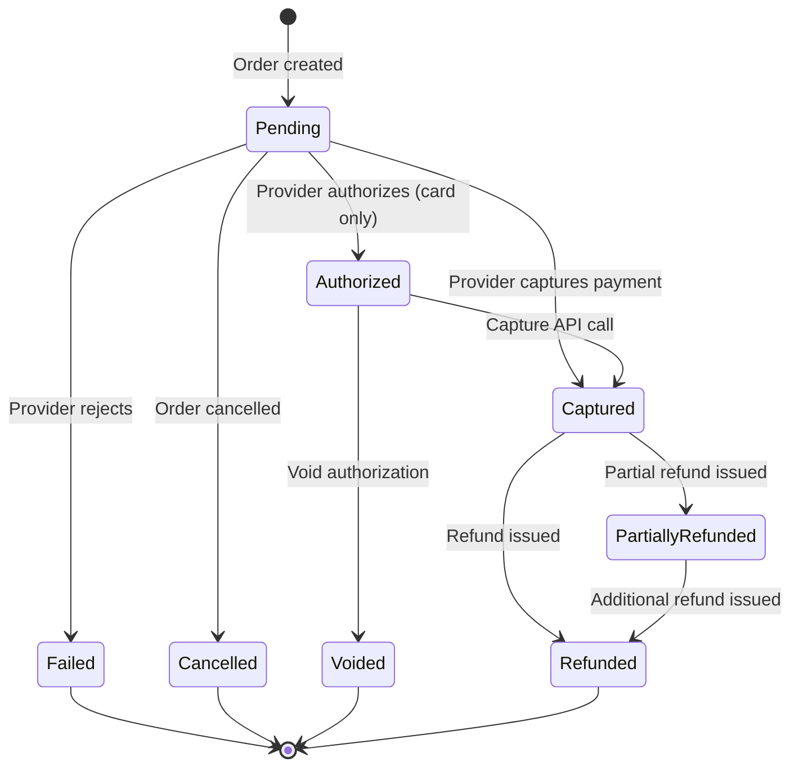
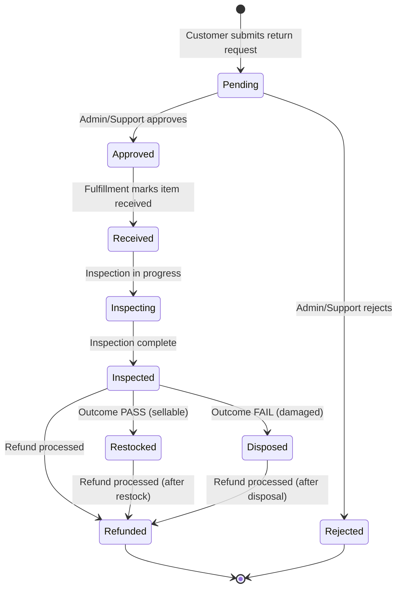
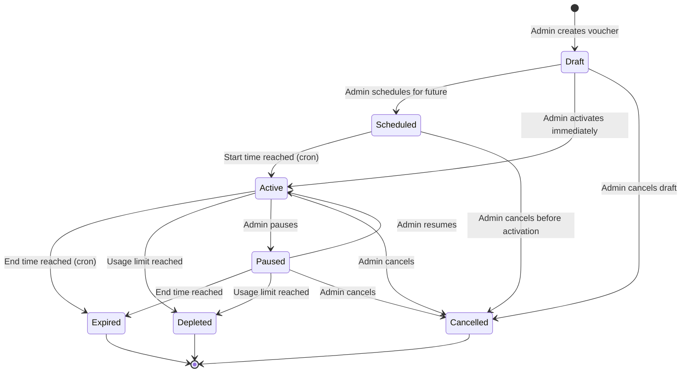
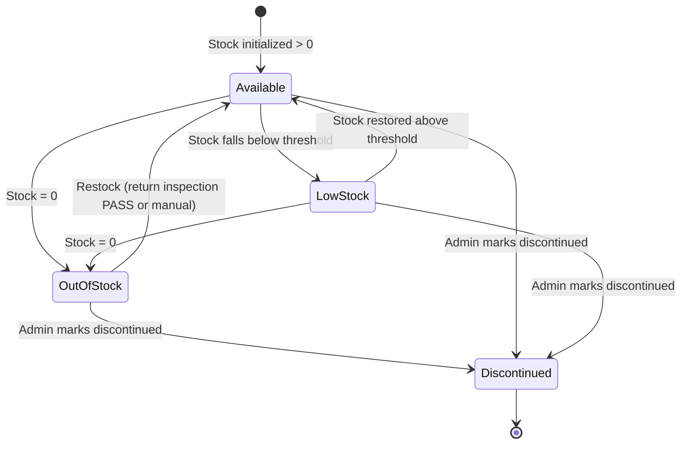
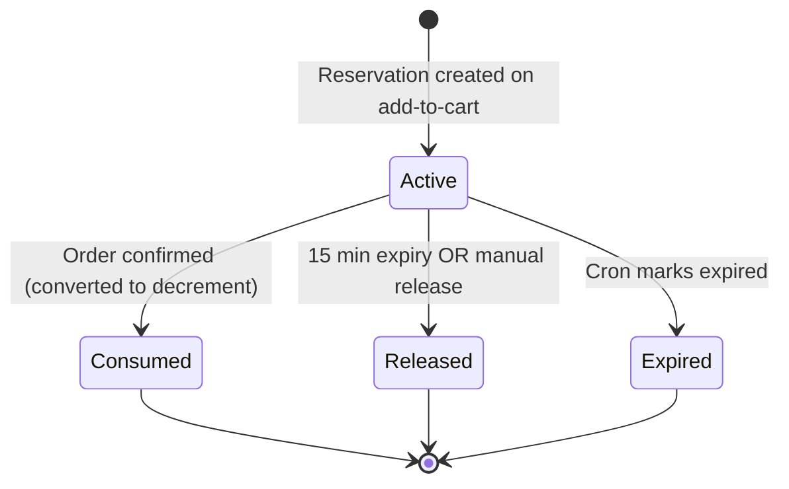

# STATE_MACHINE.md — SmartLight

**Project:** SmartLight — Single Vendor E-Commerce Platform
**Document Version:** 1.0
**Status:** Draft
**Date:** 2026-07-03
**Author:** Principal System Analyst

This document defines the **state machines** for the five core entities with lifecycle state: **Order**, **Payment**, **Return**, **Voucher**, and **Inventory**. Each state machine includes a Mermaid diagram, transition table, allowed transitions, and invalid transitions with rationale.

---

## 1. SM-ORD — Order State Machine

### 1.1 Mermaid Diagram

### 1.2 States

| State | Description | Visible to Customer? |
| --- | --- | --- |
| `Pending` | Order created, awaiting payment confirmation | Yes |
| `Confirmed` | Payment received, stock decremented | Yes |
| `Processing` | Fulfillment in progress (picking, packing) | Yes |
| `Shipped` | Handed to carrier, tracking active | Yes |
| `Delivered` | Carrier confirmed delivery | Yes |
| `Completed` | Auto-completed 7 days after delivery OR customer-confirmed | Yes |
| `Cancelled` | Cancelled before shipment (timeout, user, admin) | Yes |
| `Returned` | Customer initiated return; refund processed or in progress | Yes |

### 1.3 Transition Table

| From | To | Trigger | Actor | Pre-condition | Business Rule |
| --- | --- | --- | --- | --- | --- |
| Pending | Confirmed | Payment webhook success | System | Payment intent status = paid | BR-OSM-001 |
| Pending | Cancelled | Timeout 15 min | System (cron) | No payment received | BR-OSM-001 |
| Pending | Cancelled | User cancel | Customer / Guest | Order not yet paid | BR-OSM-001 |
| Confirmed | Processing | Start fulfillment | Admin / Fulfillment | Inventory available | BR-OSM-001 |
| Confirmed | Cancelled | Admin cancel | Admin | Not yet shipped | BR-OSM-001 |
| Processing | Shipped | Create shipment | Fulfillment | Tracking number assigned | BR-OSM-001 |
| Shipped | Delivered | Carrier webhook | System | Tracking status = delivered | BR-OSM-001, BR-SHP-005 |
| Shipped | Returned | Carrier lost | System / Admin | Carrier confirmed lost | BR-OSM-001 |
| Delivered | Completed | Customer confirms OR +7 days | System / Customer | Delivered timestamp recorded | BR-OSM-004 |
| Delivered | Returned | Customer requests return | Customer | Within 7-day return window | BR-RTN-001 |
| Completed | Returned | Customer requests return | Customer | Within warranty window | BR-RTN-001 |

### 1.4 Forbidden Transitions

| Forbidden | Reason |
| --- | --- |
| `Pending → Shipped` | Must transition through Confirmed → Processing |
| `Pending → Delivered` | Payment must be confirmed first |
| `Pending → Completed` | Order must complete the full lifecycle |
| `Cancelled → Confirmed` | Cancellation is terminal (BR-OSM-002) |
| `Cancelled → any` | Terminal state |
| `Completed → Pending` | Immutable after completion (BR-OSM-002) |
| `Completed → Confirmed` | No reactivation of completed orders |
| `Returned → Delivered` | Returned is terminal |
| `Returned → any` (except refund linkage) | Terminal state |
| `Any → Pending` | No state may revert to Pending |
| `Delivered → Cancelled` | Already shipped; cannot cancel |
| `Shipped → Cancelled` | Use Returned instead |
| `Processing → Cancelled` | Use Confirmed → Cancelled before Shipped |

### 1.5 Side Effects per Transition

| Transition | Side Effects |
| --- | --- |
| Pending → Confirmed | Stock decremented (already done at order creation in BR-INV-001); payment marked captured; confirmation email queued |
| Confirmed → Processing | Optional: picklist generated |
| Processing → Shipped | Shipment created at carrier; tracking number stored; shipment notification queued |
| Shipped → Delivered | Customer notification queued; auto-completion timer starts (7 days) |
| Delivered → Completed | Order closed; warranty window opens |
| Pending/Confirmed → Cancelled | Reservation released; payment voided or refunded |
| Delivered/Completed → Returned | Triggers RMA flow; refund workflow |

---

## 2. SM-PAY — Payment State Machine

### 2.1 Mermaid Diagram

### 2.2 States

| State | Description |
| --- | --- |
| `Pending` | Payment intent created; awaiting user action |
| `Authorized` | (Card only) Funds reserved, not yet captured |
| `Captured` | Funds transferred to merchant |
| `PartiallyRefunded` | Partial refund issued; remaining balance still captured |
| `Refunded` | Full refund issued |
| `Failed` | Provider rejected transaction |
| `Cancelled` | Order cancelled before capture |
| `Voided` | Authorization released without capture |

### 2.3 Transition Table

| From | To | Trigger | Actor | Pre-condition | Rule |
| --- | --- | --- | --- | --- | --- |
| Pending | Captured | Provider success webhook | A-PAYMENT-GW | User authorized | BR-PAY-002 |
| Pending | Failed | Provider failure webhook | A-PAYMENT-GW | User rejected / declined | BR-PAY-002 |
| Pending | Cancelled | Order cancelled before payment | System | Order in Pending | BR-PAY-006 |
| Authorized | Captured | Capture call | System | Card payment | BR-PAY-006 |
| Authorized | Voided | Void call | System / Admin | Card payment | BR-PAY-006 |
| Captured | Refunded | Refund call | Admin / Finance | Original payment valid | BR-PAY-009 |
| Captured | PartiallyRefunded | Partial refund | Admin / Finance | Remaining balance > 0 | BR-PAY-009 |
| PartiallyRefunded | Refunded | Additional refund | Admin / Finance | Full amount refunded | BR-PAY-009 |
| Pending | (Reconcile) | Reconciliation cron | System | Stale > 5 min | BR-PAY-010 |

### 2.4 Forbidden Transitions

| Forbidden | Reason |
| --- | --- |
| `Refunded → Captured` | Funds returned; cannot revert |
| `Failed → Captured` | Failed is terminal |
| `Pending → Refunded` | Capture must happen first |
| `Cancelled → Captured` | Cancellation is terminal |
| `Voided → Captured` | Authorization released |

---

## 3. SM-RTN — Return State Machine

### 3.1 Mermaid Diagram

### 3.2 States

| State | Description |
| --- | --- |
| `Pending` | Return request submitted; awaiting admin decision |
| `Approved` | Admin approved; awaiting customer to ship back |
| `Rejected` | Admin rejected with reason |
| `Received` | Fulfillment marked item received |
| `Inspecting` | Inspection in progress |
| `Inspected` | Inspection complete; outcome recorded |
| `Restocked` | Item restocked (sellable) |
| `Disposed` | Item disposed (damaged) |
| `Refunded` | Refund processed; return closed |

### 3.3 Transition Table

| From | To | Trigger | Actor | Rule |
| --- | --- | --- | --- | --- |
| Pending | Approved | Admin approves | Admin / Support | BR-RTN-004 |
| Pending | Rejected | Admin rejects | Admin / Support | BR-RTN-004 |
| Approved | Received | Fulfillment receives item | Fulfillment | — |
| Received | Inspecting | Inspection begins | Fulfillment | — |
| Inspecting | Inspected | Inspection complete | Fulfillment | — |
| Inspected | Restocked | Outcome PASS | Fulfillment | BR-INV-006 |
| Inspected | Disposed | Outcome FAIL | Fulfillment | BR-INV-006 |
| Inspected / Restocked / Disposed | Refunded | Refund processed | System | BR-PAY-009, BR-RTN-006 |

### 3.4 Forbidden Transitions

| Forbidden | Reason |
| --- | --- |
| `Pending → Restocked` | Inspection must happen |
| `Rejected → Approved` | Rejected is terminal |
| `Refunded → any` | Refunded is terminal |
| `Pending → Refunded` | Must go through inspection |

---

## 4. SM-PRM — Voucher State Machine

### 4.1 Mermaid Diagram

### 4.2 States

| State | Description |
| --- | --- |
| `Draft` | Created but not active; not visible to customers |
| `Scheduled` | Configured with future start time |
| `Active` | Within active window; usage limits available |
| `Paused` | Temporarily disabled by admin |
| `Expired` | End time passed |
| `Depleted` | Total usage limit reached |
| `Cancelled` | Admin cancelled |

### 4.3 Transition Table

| From | To | Trigger | Actor | Rule |
| --- | --- | --- | --- | --- |
| Draft | Scheduled | Admin sets future start | Admin | BR-PRM-009 |
| Draft | Active | Admin activates now | Admin | BR-PRM-009 |
| Draft | Cancelled | Admin cancels draft | Admin | — |
| Scheduled | Active | Cron: now >= startTime | System | BR-PRM-009 |
| Scheduled | Cancelled | Admin cancels | Admin | — |
| Active | Expired | Cron: now >= endTime | System | BR-PRM-009 |
| Active | Depleted | System: usageCount >= limit | System | BR-PRM-010 |
| Active | Paused | Admin pauses | Admin | — |
| Active | Cancelled | Admin cancels | Admin | — |
| Paused | Active | Admin resumes | Admin | — |
| Paused | Expired | Cron: now >= endTime | System | BR-PRM-009 |
| Paused | Depleted | System: usageCount >= limit | System | BR-PRM-010 |
| Paused | Cancelled | Admin cancels | Admin | — |

### 4.4 Forbidden Transitions

| Forbidden | Reason |
| --- | --- |
| `Expired → Active` | End time passed; cannot reactivate (admin must create new voucher) |
| `Depleted → Active` | Limit reached; cannot extend (admin must create new) |
| `Cancelled → any` | Terminal state |
| `Expired → Depleted` | Already terminal |

---

## 5. SM-INV — Inventory Stock State Machine

### 5.1 Mermaid Diagram (per Variant)

### 5.2 States

| State | Description |
| --- | --- |
| `Available` | Stock > threshold |
| `LowStock` | 0 < Stock ≤ threshold (BR-INV-004) |
| `OutOfStock` | Stock = 0 |
| `Discontinued` | Admin marked product as no longer sold |

### 5.3 Transition Table

| From | To | Trigger | Actor | Rule |
| --- | --- | --- | --- | --- |
| Available | LowStock | Stock decremented below threshold | System | BR-INV-004 |
| LowStock | Available | Stock restored above threshold | System | BR-INV-004 |
| Available | OutOfStock | Stock decremented to 0 | System | — |
| LowStock | OutOfStock | Stock decremented to 0 | System | — |
| OutOfStock | Available | Restock after return PASS, or manual adjustment | Fulfillment / Catalog Mgr | BR-INV-006, BR-INV-005 |
| Any | Discontinued | Admin marks discontinued | Catalog Mgr | — |

### 5.4 Forbidden Transitions

| Forbidden | Reason |
| --- | --- |
| `Discontinued → any` | Terminal state |
| `OutOfStock → LowStock` | Must go through Available |
| `OutOfStock → Discontinued → OutOfStock` | Cannot un-discontinue |

### 5.5 Reservation States (Per Reservation Record)

| From | To | Trigger | Rule |
| --- | --- | --- | --- |
| Active | Consumed | Order transitions Pending → Confirmed | BR-INV-001 |
| Active | Released | User removes cart line | BR-INV-002 |
| Active | Expired | Cron: expiresAt < now | BR-INV-002, BR-INV-007 |

---

## 6. State Machine Cross-References

| State Machine | Use Cases | Business Rules | SRS Reference |
| --- | --- | --- | --- |
| Order | UC-ORD-001..007 | BR-OSM-001..004 | SRS §6.20 |
| Payment | UC-PAY-001..005 | BR-PAY-006..011 | SRS §6.17 |
| Return | UC-RTN-001..005 | BR-RTN-001..007, BR-INV-006 | SRS §6.9 |
| Voucher | UC-PRM-001..004 | BR-PRM-009..010 | SRS §6.8 |
| Inventory | UC-INV-001..007 | BR-INV-001..007 | SRS §6.16 |

---

## 7. Document Control

| Version | Date | Author | Change Summary |
| --- | --- | --- | --- |
| 1.0 | 2026-07-03 | Principal System Analyst | Initial 5 state machines: Order, Payment, Return, Voucher, Inventory (incl. reservation); Mermaid + transition tables + forbidden transitions |

---

**End of Document — STATE_MACHINE.md**