# ERD.md — Entity Relationship Diagram

**Project:** SmartLight — Single Vendor E-Commerce Platform
**Document Version:** 1.0
**Status:** Draft
**Date:** 2026-07-03
**Author:** Principal Database Architect

---

## 1. Purpose

This document presents the complete **Entity Relationship Diagram** for SmartLight using Mermaid ER syntax. The ERD covers all MVP entities across 18 bounded contexts, with cardinality and resolved M:N relationships.

This is **design only**. No SQL or Prisma is generated.

---

## 2. Cardinality Legend

| Symbol | Meaning |
| --- | --- |
| `||` | exactly one |
| `o|` | zero or one |
| `}o` | zero or many |
| `}|` | one or many |

---

## 3. Master ERD — High Level

```mermaid
erDiagram
    %% Identity
    User ||--o{ Address : "has"
    User ||--o{ RefreshToken : "has"
    User ||--o{ MfaSecret : "has"
    User ||--o| MfaSecret : "secret"
    AdminUser ||--o{ MfaSecret : "has"
    AdminUser ||--o{ AdminUserRole : "assigned"
    Role ||--o{ AdminUserRole : "granted"
    Role ||--o{ RolePermission : "includes"
    Permission ||--o{ RolePermission : "granted"

    %% Catalog
    Category ||--o{ Category : "parent"
    Category ||--o{ Product : "contains"
    Brand ||--o{ Product : "supplies"
    Product ||--o{ ProductVariant : "has"
    Product ||--o{ ProductImage : "shows"
    Product ||--o{ ProductAttributeValue : "specifies"
    ProductAttribute ||--o{ ProductAttributeValue : "values"
    ProductVariant ||--o{ ProductAttributeValue : "attributes"

    %% Inventory
    ProductVariant ||--|| Inventory : "tracks"
    ProductVariant ||--o{ StockReservation : "reserves"
    ProductVariant ||--o{ StockMovement : "moves"
    ProductVariant ||--o{ InventoryAdjustment : "adjusts"

    %% Media
    MediaFile ||--o{ MediaVariant : "renders"

    %% Cart
    User ||--o{ Cart : "owns"
    Cart ||--o{ CartItem : "contains"
    ProductVariant ||--o{ CartItem : "referenced"

    %% Checkout
    User ||--o{ CheckoutSession : "initiates"
    Cart ||--o| CheckoutSession : "snapshot"
    CheckoutSession ||--|| Address : "ships to"

    %% Promotion
    Promotion ||--o{ PromotionUsage : "tracks"
    User ||--o{ PromotionUsage : "redeems"
    Voucher ||--o{ VoucherUsage : "tracks"
    User ||--o{ VoucherUsage : "redeems"
    Promotion ||--o| Voucher : "codes"

    %% Tax
    TaxRate ||--o{ Category : "applies"
    Category ||--o| TaxExemption : "exempt?"

    %% Order
    User ||--o{ Order : "places"
    Order ||--o{ OrderItem : "contains"
    Order ||--o{ OrderStatusHistory : "transitions"
    Order ||--|| OrderAddress : "ships"
    Order ||--o| Payment : "pays"
    Order ||--o| Shipment : "ships"
    Order ||--o| Voucher : "applies"
    ProductVariant ||--o{ OrderItem : "ordered"

    %% Payment
    Payment ||--o{ PaymentTransaction : "events"
    Payment ||--o{ WebhookEvent : "logs"
    Payment ||--o{ Refund : "refunded"
    WebhookEvent ||--o{ Payment : "applies"

    %% Shipping
    ShippingZone ||--o{ Shipment : "ships in"
    Shipment ||--o{ TrackingEvent : "events"

    %% Returns
    Order ||--o{ Return : "returns"
    Return ||--o{ ReturnItem : "contains"
    OrderItem ||--o{ ReturnItem : "returns"
    Return ||--o{ ReturnInspection : "inspects"

    %% Reviews
    Product ||--o{ Review : "reviews"
    User ||--o{ Review : "writes"
    OrderItem ||--o| Review : "rates"
    Review ||--o{ ReviewHelpfulVote : "votes"
    Review ||--o| ReviewReply : "admin reply"

    %% Notifications
    EmailTemplate ||--o{ NotificationLog : "renders"
    User ||--o{ NotificationLog : "receives"
    User ||--o{ NotificationPreference : "preferences"
    User ||--o{ CookieConsent : "consents"

    %% Support
    User ||--o{ SupportTicket : "creates"
    SupportTicket ||--o{ TicketMessage : "thread"
    Order ||--o{ SupportTicket : "linked"

    %% Audit
    User ||--o{ AuditLog : "actor"
    AdminUser ||--o{ AuditLog : "actor"

    %% Platform
    FeatureFlag ||--o{ FeatureFlagOverride : "overrides"
```

---

## 4. Identity Context ERD

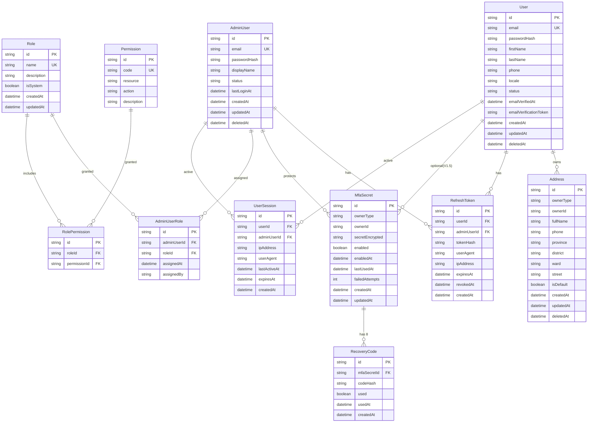

---

## 5. Catalog Context ERD

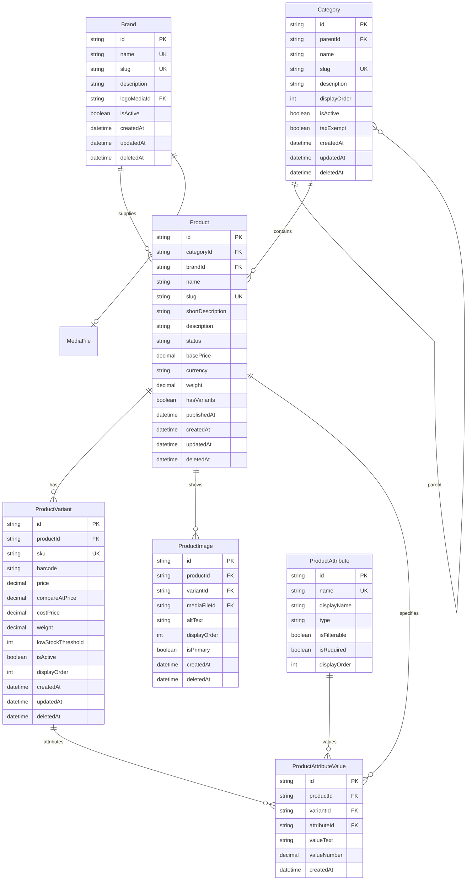

---

## 6. Inventory Context ERD

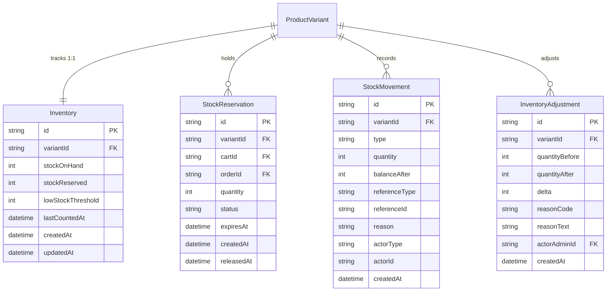

---

## 7. Cart & Checkout Context ERD

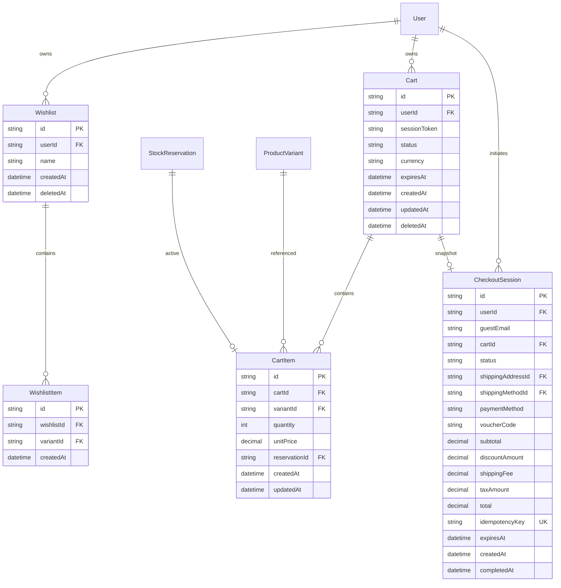

> **Note:** Wishlist, WishlistItem are V1.1 features; included for completeness but not in MVP build.

---

## 8. Promotion & Tax Context ERD

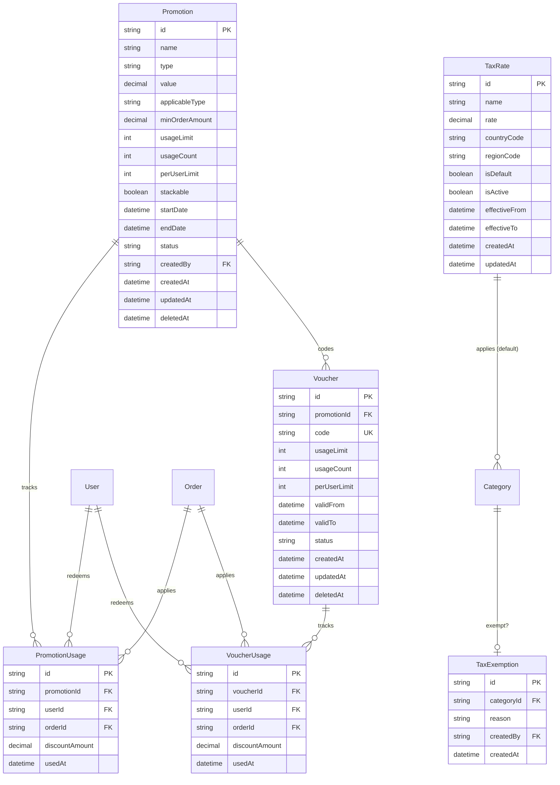

---

## 9. Order Context ERD

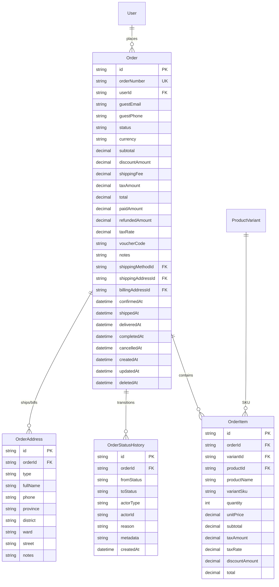

---

## 10. Payment Context ERD

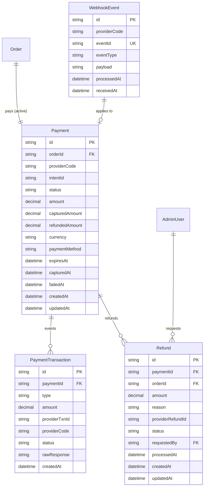

---

## 11. Shipping Context ERD

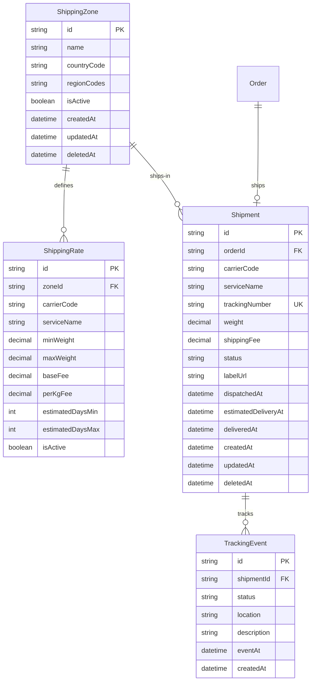

---

## 12. Returns Context ERD

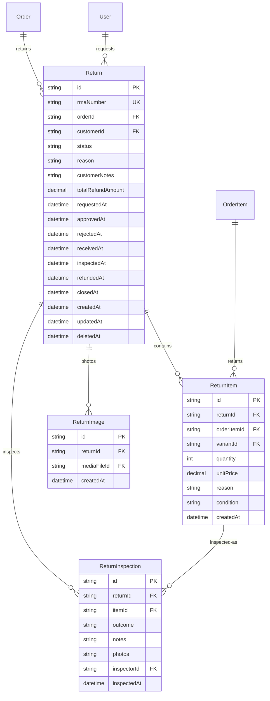

---

## 13. Reviews Context ERD

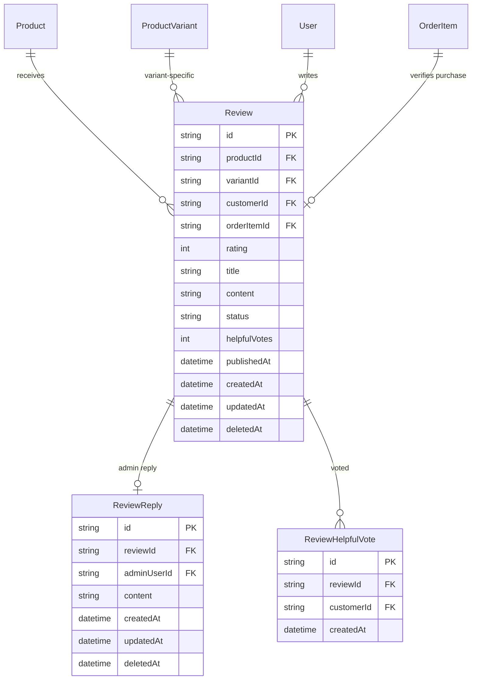

---

## 14. Notifications Context ERD

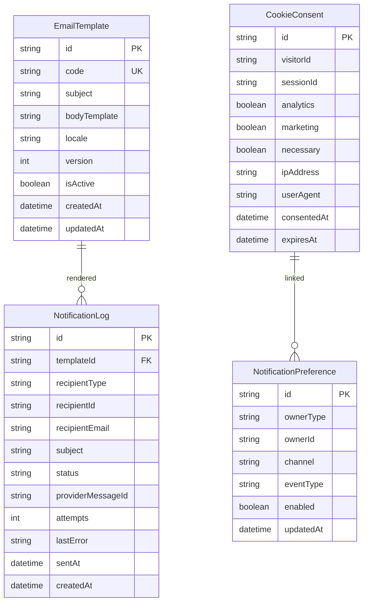

---

## 15. Support Context ERD

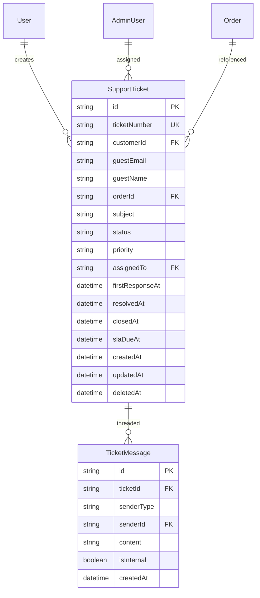

---

## 16. Audit & Platform Context ERD

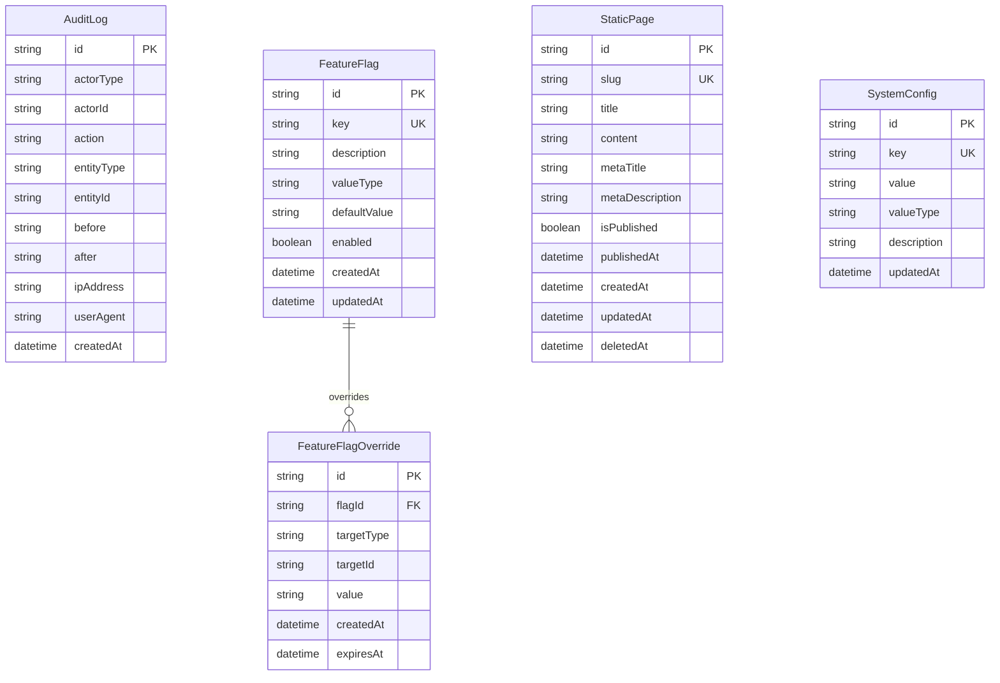

---

## 17. Resolved M:N Relationships

The following M:N relationships are resolved via junction entities:

| M:N Relationship | Resolved Via |
| --- | --- |
| AdminUser ↔ Role | `AdminUserRole` |
| Role ↔ Permission | `RolePermission` |
| Product ↔ ProductAttribute | `ProductAttributeValue` |
| ProductVariant ↔ ProductAttribute | `ProductAttributeValue` |
| ProductVariant ↔ ProductImage (some images variant-specific) | `ProductImage.variantId` |
| Promotion ↔ User (per-user usage tracking) | `PromotionUsage` |
| Voucher ↔ User | `VoucherUsage` |
| Review ↔ User (helpful votes) | `ReviewHelpfulVote` |
| NotificationPreference ↔ User | `NotificationPreference` (ownerId) |
| EmailTemplate ↔ Locale | `EmailTemplate.locale` |

---

## 18. Polymorphic References

Some entities reference owners that may be `User` or `AdminUser`. This is handled via **polymorphic associations** with two columns:

| Entity | OwnerType | OwnerId |
| --- | --- | --- |
| Address | 'User' / 'AdminUser' | FK to one or the other |
| MfaSecret | 'User' / 'AdminUser' | FK |
| RefreshToken | 'User' / 'AdminUser' | FK |
| UserSession | 'User' / 'AdminUser' | FK |
| NotificationPreference | 'User' / 'AdminUser' | FK |
| AuditLog | 'User' / 'AdminUser' / 'System' | FK |
| NotificationLog | 'User' / 'AdminUser' / 'Guest' | FK |
| SupportTicket.assignedTo | 'AdminUser' | FK |
| TicketMessage.senderId | 'User' / 'AdminUser' | FK |

**Implementation:** Use a single `ownerType` enum + `ownerId` text column, with **logical foreign key** discipline at the application layer.

---

## 19. ERD Coverage Validation

| Check | Status |
| --- | --- |
| All 18 bounded contexts represented | ✓ |
| All M:N relationships resolved | ✓ |
| Cardinality specified for every relationship | ✓ |
| Polymorphic references documented | ✓ |
| Aggregate roots clear | ✓ |
| No foreign keys to non-existent entities | ✓ |
| Read-heavy entities identifiable | ✓ |
| Future V1.1+ entities shown but separated | ✓ |

---

## 20. Document Control

| Version | Date | Author | Change Summary |
| --- | --- | --- | --- |
| 1.0 | 2026-07-03 | Principal Database Architect | Initial ERD: master + 12 sub-context diagrams, M:N resolution, polymorphic references |

---

**End of Document — ERD.md**