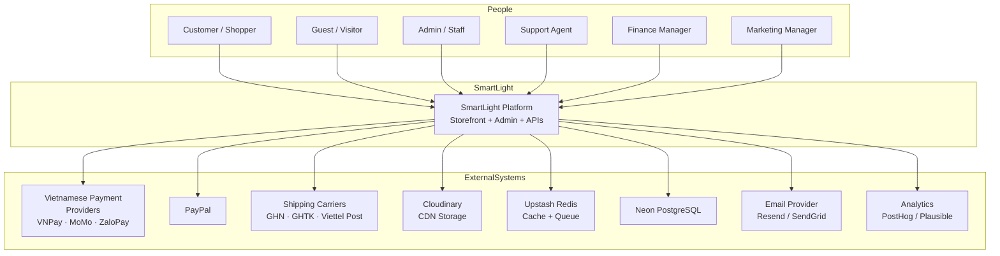
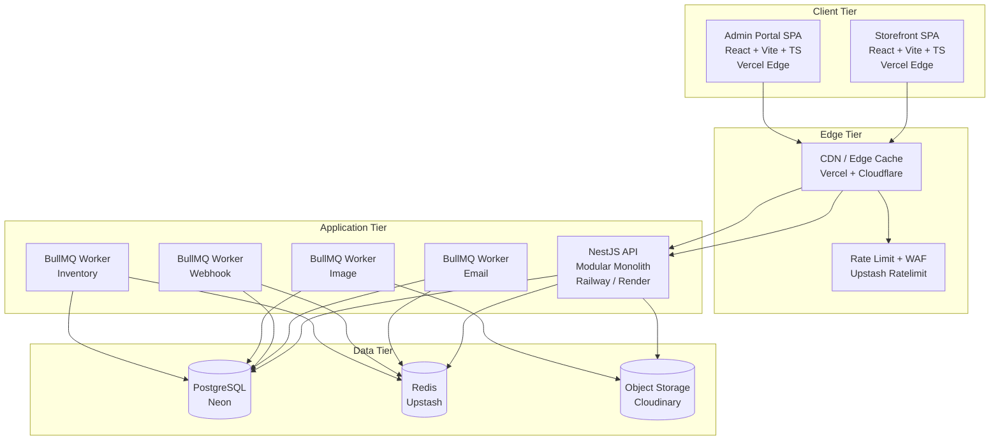
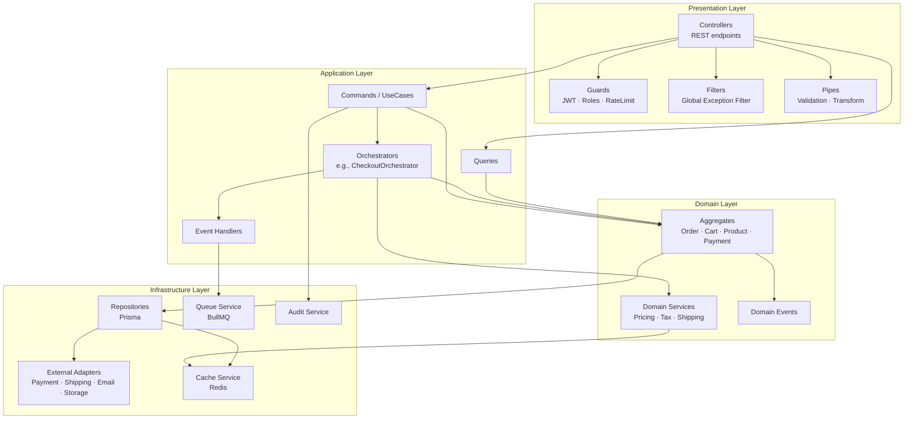
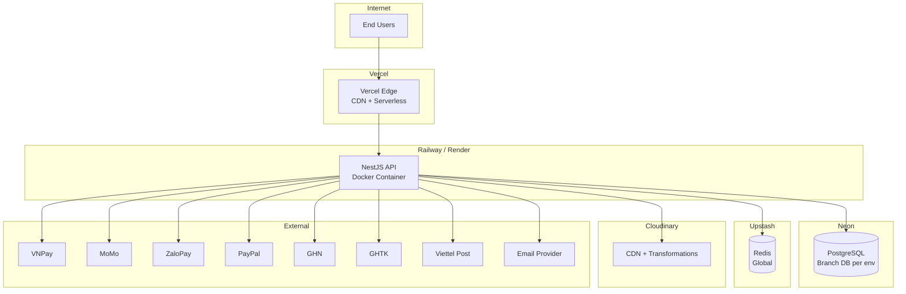

# 01 — System Architecture

**Project:** SmartLight — Single Vendor E-Commerce Platform
**Document Version:** 1.0
**Status:** Draft
**Date:** 2026-07-04
**Author:** Chief Software Architect

---

## 1. Purpose

This document describes the **end-to-end system architecture** for SmartLight: the actors, containers, components, deployment topology, and external integrations. It is the master architectural reference.

---

## 2. Architecture Style

| Aspect | Decision |
|---|---|
| Style | Modular Monolith (V1); future Microservices (V2) |
| Backend Framework | NestJS |
| Frontend Framework | React + Vite + TypeScript |
| ORM | Prisma |
| Database | PostgreSQL (Neon) |
| Cache | Redis (Upstash) |
| Queue / Event Bus | BullMQ (Redis-backed) |
| Object Storage | Cloudinary (V1); S3/MinIO (V2) |
| API Style | REST + JSON; OpenAPI 3.1 |
| Auth | JWT + Refresh Tokens |
| Deployment | Docker → Vercel / Railway / Neon / Upstash |
| Future Orchestrator | Kubernetes |

---

## 3. System Context (C4 Level 1)

This diagram shows SmartLight as a black box and the people / external systems that interact with it.



---

## 4. Container Diagram (C4 Level 2)

This diagram zooms into SmartLight and shows the deployable containers.



### 4.1 Container Responsibilities

| Container | Tech | Responsibility |
|---|---|---|
| **Storefront** | React + Vite | Customer-facing UI; product browsing, cart, checkout, account |
| **Admin Portal** | React + Vite | Admin UI; catalog, orders, payments, customers, reports |
| **CDN/Edge** | Vercel + Cloudflare | Static asset delivery; HTTP cache; DDoS protection |
| **Rate Limit** | Upstash Ratelimit | API throttling (V1.5+) |
| **NestJS API** | NestJS + Prisma | All REST endpoints; synchronous business logic |
| **Email Worker** | BullMQ | Email queue processing |
| **Webhook Worker** | BullMQ | Outbound retries + scheduled jobs |
| **Image Worker** | BullMQ | Cloudinary transformations, optimization |
| **Inventory Worker** | BullMQ | Stock reconciliation, low-stock alerts |
| **PostgreSQL** | Neon | Primary data store |
| **Redis** | Upstash | Cache, sessions, idempotency, rate limit, queues |
| **Cloudinary** | Cloudinary CDN | Image / video / asset storage |

---

## 5. Component Diagram (C4 Level 3 — Backend Modules)

The NestJS API is a modular monolith composed of the following bounded-context modules:



---

## 6. Deployment Diagram (MVP)

The MVP is deployed across four cloud services:



---

## 7. Bounded Contexts

The backend is organized into 18 bounded contexts (per System Analysis). In V1, each is a NestJS module; in V2, each can become its own microservice.

| # | Bounded Context | Aggregate Roots | Notes |
|---|---|---|---|
| 1 | **Identity** | user, admin_user, refresh_token, session | Auth + sessions |
| 2 | **User** | user_profile, address, notification_preference | Profile + PDPD |
| 3 | **Catalog** | category, brand, product, product_variant, product_attribute, product_image | Browsable catalog |
| 4 | **Inventory** | inventory, stock_reservation, stock_movement, inventory_adjustment | Stock control |
| 5 | **Cart** | cart, cart_item | Session/user carts |
| 6 | **Checkout** | checkout_session | Multi-step session |
| 7 | **Order** | order, order_item, order_address, return | Order lifecycle |
| 8 | **Payment** | payment, payment_transaction, refund | Payments + refunds |
| 9 | **Shipping** | shipping_zone, shipping_rate, shipment, tracking_event | Carriers |
| 10 | **Promotion** | promotion, voucher, promotion_usage, voucher_usage | Discounts |
| 11 | **Review** | review, review_reply, review_helpful_vote | Ratings |
| 12 | **Notification** | email_template, notification_log, cookie_consent | Templated notifications |
| 13 | **Media** | media_file | Asset registry |
| 14 | **Support** | support_ticket, ticket_message | Customer support |
| 15 | **Admin** | role, permission, admin_user_role, role_permission | RBAC |
| 16 | **Audit** | audit_log, webhook_event | Compliance + ops |
| 17 | **Platform** | feature_flag, system_config, static_page | Cross-cutting config |
| 18 | **AI (future)** | ai_search_log, recommendation | Future only |

---

## 8. Module Communication

### 8.1 Synchronous Communication

Used **only** when a transaction crosses contexts and consistency must be immediate.

```
┌────────────┐   direct call   ┌────────────┐
│  Cart      │ ───────────────▶│  Inventory │
└────────────┘                 └────────────┘
       │                              ▲
       │    during Checkout           │
       ▼                              │
┌────────────┐  orchestrate  ┌────────────┐
│  Checkout  │ ──────────────▶│  Order     │
└────────────┘                └────────────┘
```

**Rules:**
- Synchronous calls via injected service interfaces (no HTTP).
- Always use the **public service interface** of the target module (no DB access).
- Transactions are owned by the calling module.

### 8.2 Asynchronous Communication

For cross-module eventual-consistency flows:

```
┌──────────┐  emit  ┌──────────┐  enqueue  ┌──────────┐
│  Order   │ ──────▶│  Event   │ ─────────▶│  BullMQ  │
└──────────┘        │  Bus     │            └──────────┘
                    └──────────┘                 │
                                                 ▼
                                          ┌──────────┐
                                          │ Worker   │
                                          └──────────┘
```

**Examples:**
- OrderPlaced → Inventory.ReserveStock → Notification.SendOrderConfirmation
- PaymentCaptured → Order.Confirm → Notification.SendReceipt
- ReviewSubmitted → Notification.SendReviewReply

> See `05_EVENT_DRIVEN_ARCHITECTURE.md` for details.

---

## 9. Technology Stack

### 9.1 Frontend Stack

| Concern | Choice |
|---|---|
| Framework | React 18 + Vite |
| Language | TypeScript (strict) |
| Routing | TanStack Router |
| State (Server) | TanStack Query (REST cache) |
| State (Client) | Zustand |
| Forms | React Hook Form + Zod |
| Styling | Tailwind CSS + shadcn/ui |
| i18n | react-i18next |
| Testing | Vitest + Testing Library |
| E2E | Playwright |

### 9.2 Backend Stack

| Concern | Choice |
|---|---|
| Framework | NestJS 10 (Express adapter) |
| Language | TypeScript (strict) |
| ORM | Prisma 5 |
| Database | PostgreSQL 16 (Neon) |
| Cache | Redis (Upstash) |
| Queue | BullMQ |
| Validation | class-validator + class-transformer |
| Auth | Passport (JWT) + custom refresh |
| Logging | Pino + nestjs-pino |
| Testing | Jest + supertest |
| Mocking | ts-mockito |

### 9.3 Infrastructure Stack

| Concern | Choice |
|---|---|
| Frontend Hosting | Vercel |
| Backend Hosting | Railway (primary) / Render (fallback) |
| Database | Neon PostgreSQL |
| Cache / Queue | Upstash Redis |
| Object Storage | Cloudinary |
| Email | Resend (V1) |
| CDN | Vercel + Cloudinary |
| CI/CD | GitHub Actions |
| Monitoring | BetterStack / Highlight.io (V1.5) |

### 9.4 Dev Tooling

| Concern | Choice |
|---|---|
| Package Manager | pnpm |
| Linting | ESLint + Prettier |
| Commit Hooks | Husky + lint-staged |
| Commit Convention | Conventional Commits |
| Release | Semantic Release (V1.1+) |
| Documentation | Markdown + Mermaid |

---

## 10. External Integrations

| Integration | Type | Purpose | V1 Status |
|---|---|---|---|
| **VNPay** | Payment | Primary Vietnamese gateway | Live |
| **MoMo** | Payment | Mobile wallet | Live |
| **ZaloPay** | Payment | Mobile wallet | Live |
| **PayPal** | Payment | International | Live |
| **Bank Transfer** | Payment | Manual verification | V1.1 |
| **GHN** | Shipping | Domestic express | Live |
| **GHTK** | Shipping | Domestic economy | Live |
| **Viettel Post** | Shipping | National reach | Live |
| **VNPost** | Shipping | Public postal | V1.1 |
| **Cloudinary** | Storage | Image hosting + CDN | Live |
| **Email (Resend)** | Notification | Transactional email | Live |
| **Google Login** | Auth | OAuth provider | V1.5 |
| **Facebook Login** | Auth | OAuth provider | V1.5 |

---

## 11. Architecture Principles

| Principle | Application |
|---|---|
| **Startup First** | MVP-ready; minimal over-engineering |
| **Enterprise Ready** | Observability, security, audit from day one |
| **Clean Architecture** | Strict layering; domain at center |
| **DDD** | Aggregate roots, value objects, domain events |
| **SOLID** | Single responsibility; interface segregation |
| **KISS** | No premature abstractions |
| **YAGNI** | No speculative features |
| **DRY** | Shared kernel; common abstractions |
| **Future Microservices** | Bounded contexts can become services |

---

## 12. Cross-Cutting Concerns

Each concern is detailed in a dedicated document:

| Concern | Document |
|---|---|
| Modules | `02_MODULE_ARCHITECTURE.md` |
| Layers | `03_LAYERED_ARCHITECTURE.md` |
| Dependency Rules | `04_DEPENDENCY_RULES.md` |
| Events | `05_EVENT_DRIVEN_ARCHITECTURE.md` |
| Security | `06_SECURITY_ARCHITECTURE.md` |
| Authorization | `07_AUTHORIZATION_ARCHITECTURE.md` |
| Configuration | `08_CONFIGURATION_ARCHITECTURE.md` |
| Logging | `09_LOGGING_ARCHITECTURE.md` |
| Exceptions | `10_EXCEPTION_HANDLING.md` |
| Caching | `11_CACHING_ARCHITECTURE.md` |
| File Storage | `12_FILE_STORAGE_ARCHITECTURE.md` |
| Notifications | `13_NOTIFICATION_ARCHITECTURE.md` |
| AI (future) | `14_AI_ARCHITECTURE.md` |
| Background Jobs | `15_BACKGROUND_JOB_ARCHITECTURE.md` |
| Observability | `16_OBSERVABILITY.md` |
| Docker | `17_DOCKER_ARCHITECTURE.md` |
| Deployment | `18_DEPLOYMENT_ARCHITECTURE.md` |
| CI/CD | `19_CI_CD_ARCHITECTURE.md` |
| Scalability | `20_SCALABILITY_PLAN.md` |
| Microservice Migration | `21_MICROSERVICE_MIGRATION_PLAN.md` |
| Tech Decisions | `22_TECHNOLOGY_DECISIONS.md` |
| Coding Standards | `23_CODING_STANDARDS.md` |
| ADRs | `24_ARCHITECTURE_DECISION_RECORDS.md` |
| Risks | `25_RISK_ANALYSIS.md` |
| Traceability | `26_ARCHITECTURE_TRACEABILITY.md` |

---

## 13. Coverage Validation

| Check | Status |
|---|---|
| System context diagram present | ✓ |
| Container diagram present | ✓ |
| Component diagram present | ✓ |
| Deployment diagram present | ✓ |
| Module communication described | ✓ |
| Technology stack documented | ✓ |
| External integrations listed | ✓ |
| Bounded contexts listed | ✓ |
| Architecture principles stated | ✓ |
| Cross-cutting concerns mapped to docs | ✓ |

---

## 14. Document Control

| Version | Date | Author | Change |
|---|---|---|---|
| 1.0 | 2026-07-04 | Chief Software Architect | Initial system architecture: C4 levels 1–3 + deployment |

---

**End of 01_SYSTEM_ARCHITECTURE.md**